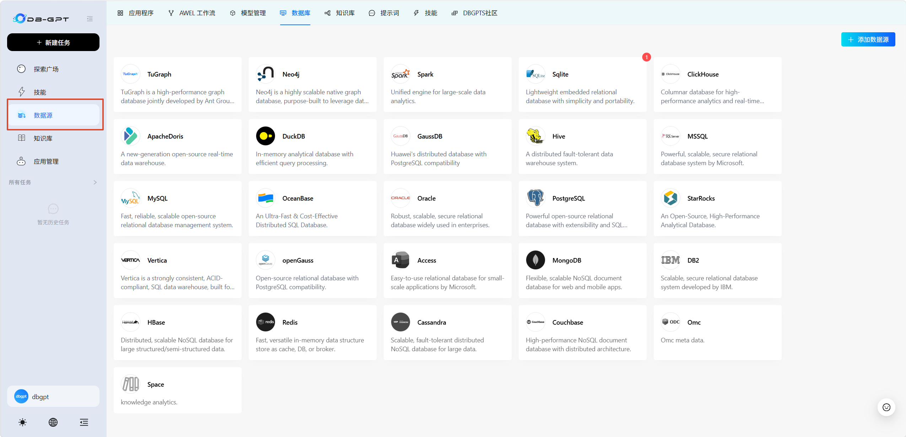
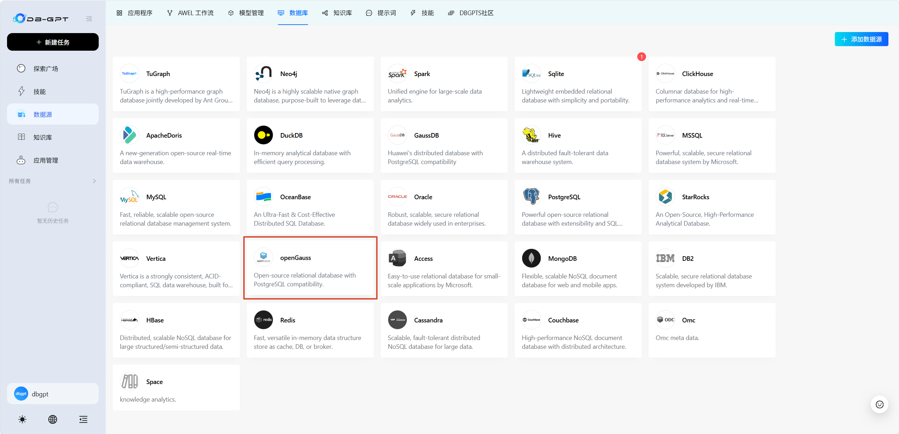
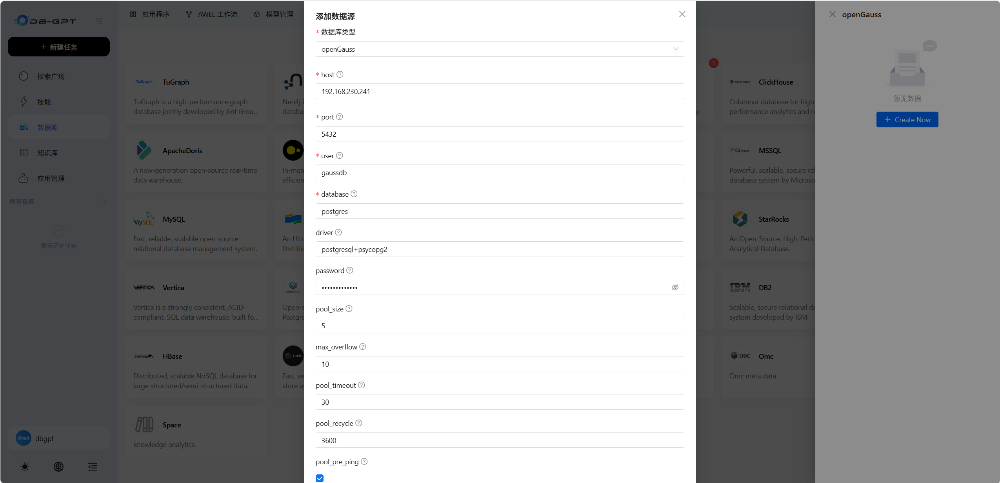
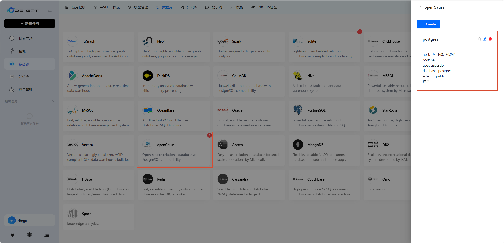
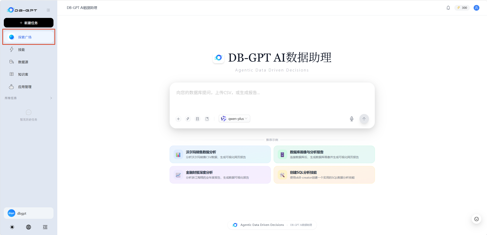
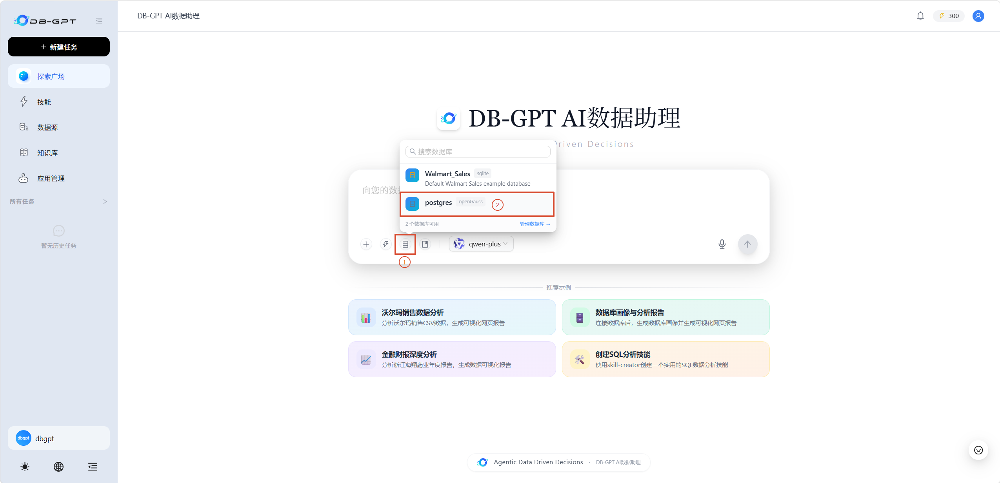
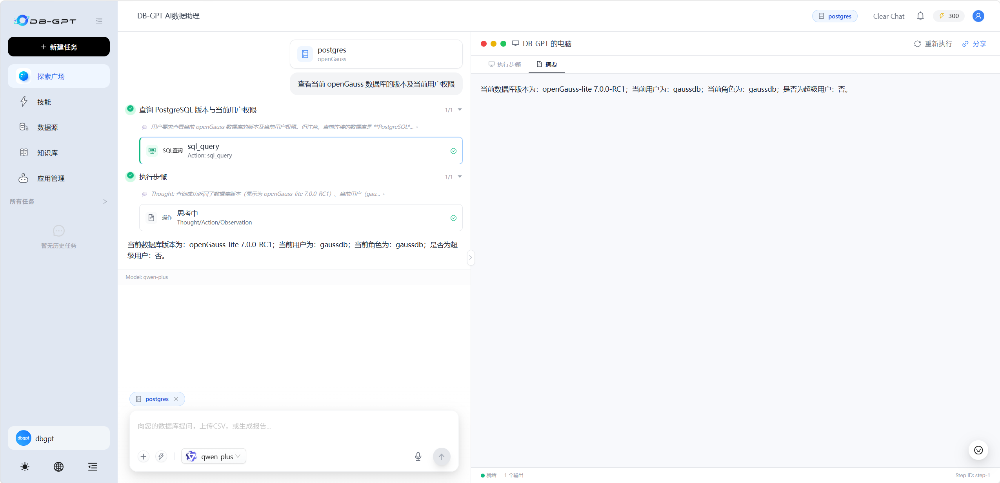

# DB-GPT 对接 openGauss：从部署到自然语言查询的实战指南

DB-GPT 是一个开源的 AI 原生数据应用开发框架，旨在简化大模型与数据库的交互。它集成了 RAG、Text-to-SQL、和多智能体协作等核心技术，支持私有化部署以保障数据安全。通过该框架，开发者可以用极少的代码构建出支持自然语言查询、自动生成报表和知识库问答的智能应用。

DB-GPT 从 v0.8.1 版本开始支持纳管 openGauss 数据库。本文介绍如何使用容器部署 DB-GPT 并纳管 openGauss 数据库，实现自然语言查询。


## 准备工作

**（1）配置 Docker 环境**

本文以容器方式启动 openGauss 实例，因此需要安装 Docker，可参考 [Manuals | Docker Docs](https://docs.docker.com/manuals/) 。

若本地已安装 openGauss 或不需要以容器方式启动可跳过该步骤。


**（2）LLM 和 Embeddings 模型**

本文使用千问模型，通过[大模型服务平台百炼控制台](https://bailian.console.aliyun.com/cn-beijing?spm=5176.12818093_47.resourceCenter.1.1b8416d0xa1cot&tab=model#/api-key)获取API Key。


## 部署 openGauss 实例

此处以容器方式启动：

```shell
$ docker run -d \
    --name opengauss \
    --privileged=true \
    --restart=always \
    -p 5432:5432 \
    -e GS_PASSWORD=openGauss@123 \
    -v ./opengauss:/var/lib/opengauss/data \
    opengauss/opengauss:7.0.0-RC1
```

> openGauss  容器默认已存在 gaussdb 用户和 postgres 库，启动时使用环境变量 `GS_PASSWORD` 指定用户密码。


## 部署 DB-GPT

**（1）拉取官方镜像**

```shell
$ docker pull eosphorosai/dbgpt-openai:latest
```


**（2）启动容器**

使用配置文件 `dbgpt-proxy-tongyi.toml`，并使用环境变量 `DASHSCOPE_API_KEY` 指定 API Key

```shell
$ docker run -d \
    --name dbgpt \
    --restart=always \
    -p 5670:5670 \
    -e DBGPT_LANG=zh \
    -e DASHSCOPE_API_KEY=sk-your-api-key \
    eosphorosai/dbgpt-openai:latest \
    dbgpt start webserver --config /app/configs/dbgpt-proxy-tongyi.toml
```

容器成功运行后，可以在浏览器中访问 http://YOUR_SERVER_IP:5670 进入 DB-GPT 主页。


## 对接 openGauss

**（1）添加 openGauss 数据库**

① 点击左侧栏 “数据源”，进入添加数据库页面。




② 选择 “openGauss”，进入配置界面。




③ 填写必要的连接信息并点击“提交”。




④ 确认 openGauss 数据库添加成功。




**（2）使用自然语言查询**

① 点击左侧栏“探索广场”，进入对话界面。




② 选择数据库 “openGauss”。




③ 进行问答测试。




## FAQ

若在添加数据库时出现以下报错：

```
Request error
Test connection Failure!No module named 'psycopg2'
```

则需要在容器内安装 psycopg2-binary 依赖包，例如 `pip install psycopg2-binary` 。


如果您想进一步了解如何使用 DB-GPT，请参阅[官方文档](http://docs.dbgpt.cn/zh-CN/docs/overview)。


