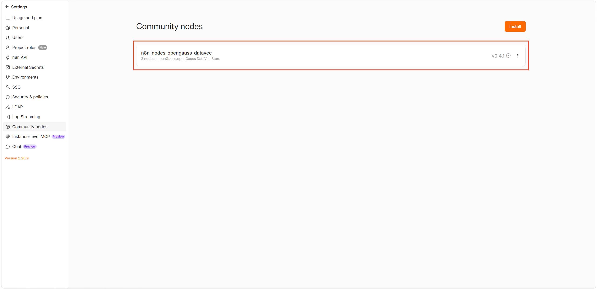
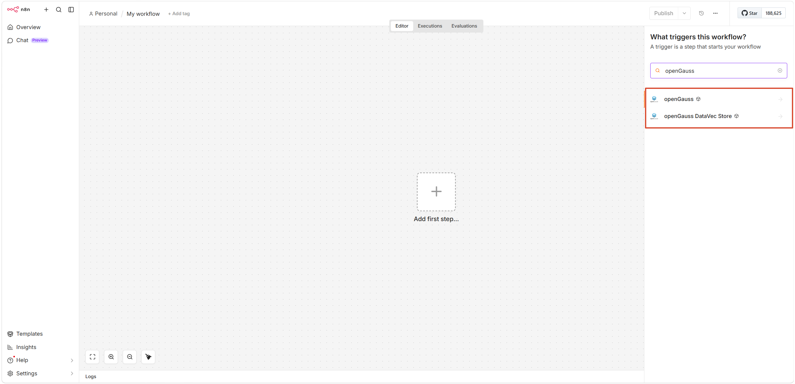
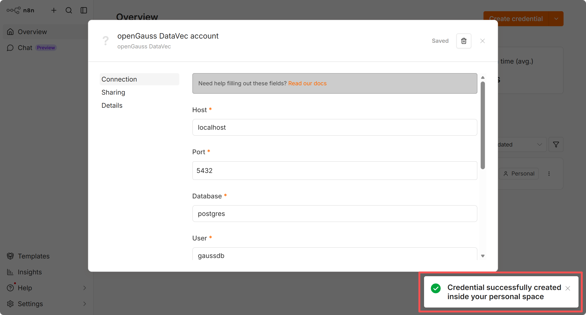
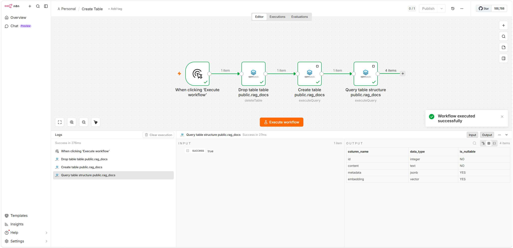
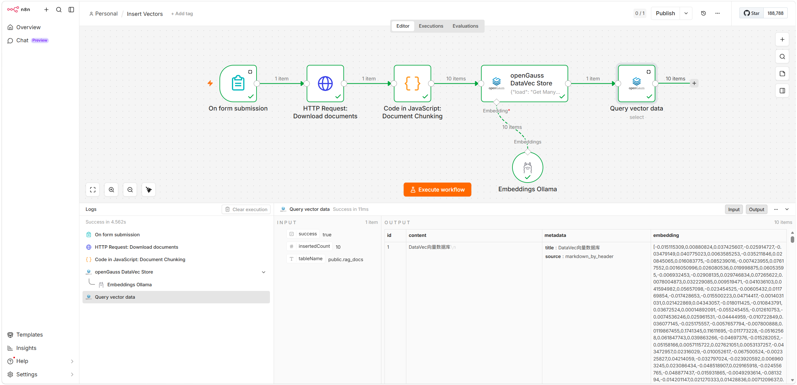
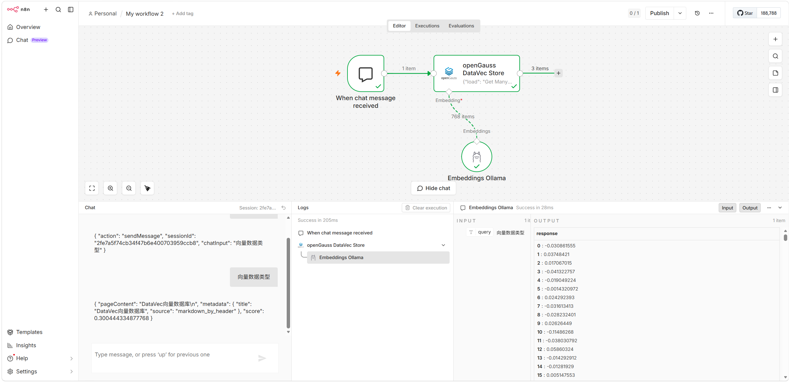
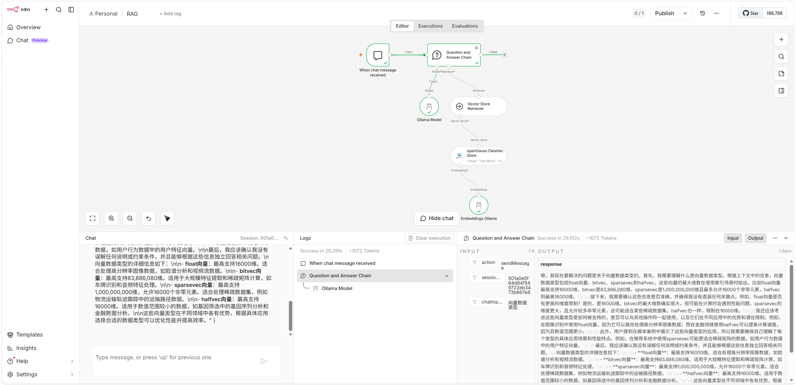

# 在 n8n 中使用 openGauss DataVec 向量数据库

[n8n](https://github.com/n8n-io/n8n) 是一个开源的工作流自动化平台，借助其节点编排能力可以构建从数据集成到 AI 智能体的各类工作流。本文介绍如何在 n8n 中安装并使用社区节点 `n8n-nodes-opengauss-datavec`，将 openGauss DataVec 作为向量数据库用于向量检索和 RAG 等场景。

## 概述

`n8n-nodes-opengauss-datavec` 是一个 n8n 社区节点包，封装了 openGauss / openGauss DataVec 向量数据库扩展，提供两个互补的节点：一个面向 LangChain/AI Agent 生态的向量库节点，一个面向传统数据操作的通用 SQL 节点。两者共用同一套 `openGaussDataVecApi` 凭证，可在同一工作流里自由组合（例如：先用 SQL 节点建表，再用向量库节点灌库与检索）。

包含组件：

- **openGauss DataVec Store** — AI Vector Store 节点，4 种模式
- **openGauss** — 通用 SQL 节点，6 种操作
- **openGauss DataVec API** — 数据库凭证

推荐节点选型如下表所示：

| 场景                                              | 推荐节点                  | 关键模式 / 操作                            |
| ------------------------------------------------- | ------------------------- | ------------------------------------------ |
| 把文档 + Embedding 写入向量表                     | openGauss DataVec Store   | Insert Documents                           |
| 在数据管道里独立做向量召回（不连接 Chain）        | openGauss DataVec Store   | Get Many                                   |
| 给 Question & Answer Chain / Retriever 提供向量库 | openGauss DataVec Store   | Retrieve Documents (As Vector Store)       |
| 让 AI Agent 把向量检索当作工具调用                | openGauss DataVec Store   | Retrieve Documents (As Tool for AI Agent)  |
| 自由 SQL（DDL / 复杂查询 / 临时报表）             | openGauss                 | Execute Query                              |
| 结构化表的增删改查（业务表 CRUD）                 | openGauss                 | Insert / Select / Update / Upsert / Delete |
| 让 AI Agent 直接读写业务表                        | openGauss（usableAsTool） | 任意操作                                   |

## 环境准备

### 启动 openGauss 实例

本文以容器方式启动 openGauss 实例。

```shell
# 启动容器
$ docker run -d \
    --name opengauss \
    --privileged=true \
    --restart=always \
    -p 5432:5432 \
    -e GS_PASSWORD=openGauss@123 \
    -v ./opengauss:/var/lib/opengauss/data \
    opengauss/opengauss:7.0.0-RC1
    
# 确认容器正常运行
$ docker ps
CONTAINER ID   IMAGE                           COMMAND                  CREATED         STATUS         PORTS                                         NAMES
28f7942c4dba   opengauss/opengauss:7.0.0-RC1   "entrypoint.sh gauss…"   3 seconds ago   Up 3 seconds   0.0.0.0:5432->5432/tcp, [::]:5432->5432/tcp   opengauss
```

> [!NOTE]说明
> openGauss 容器默认已创建 gaussdb 用户和 postgres 库，启动时使用环境变量 `GS_PASSWORD` 指定用户密码。

### 部署 n8n

本文以容器方式部署 n8n 。

```shell
# 创建挂载卷
$ docker volume create n8n_data

# 启动容器
$ docker run -it -d \
    --name n8n \
    -p 5678:5678 \
    -v n8n_data:/home/node/.n8n \
    docker.n8n.io/n8nio/n8n

# 确认容器正常运行
$ docker ps
CONTAINER ID   IMAGE                           COMMAND                  CREATED         STATUS         PORTS                                         NAMES
6dbb4b4f7fca   docker.n8n.io/n8nio/n8n         "tini -- /docker-ent…"   4 seconds ago   Up 4 seconds   0.0.0.0:5678->5678/tcp, [::]:5678->5678/tcp   n8n
```

通过访问 http://YOUR_SERVER_IP:5678 进入 n8n 登录页面。

## 安装并配置节点

### 安装节点

**（1）通过 n8n UI 在线安装节点**

1. n8n 启动后访问 `http://YOUR_SERVER_IP:5678`
2. 进入 **Settings → Community Nodes → Install a community node**
3. 输入包名：`n8n-nodes-opengauss-datavec`
4. 勾选「I understand the risks」并点击 **Install**
5. 安装完成后可以看到已安装的包及版本




**（2）验证节点能否正常加载**

1. 浏览器访问 `http://YOUR_SERVER_IP:5678`
2. 左侧菜单点击 **+** 按钮 → **Workflow**，新建工作流
3. 点击画布中央的 **+** 按钮，在弹出的节点窗口中搜索 **openGauss**
4. 出现 *openGauss** 和 **openGauss DataVec Store** 节点即安装成功



### 配置连接凭据

凭据用于建立到 openGauss 的连接，所有节点共享。

1. 左侧菜单点击 **+** 按钮 → **Credentials → Add new credential**

2. 搜索并选择 **openGauss DataVec**

3. 填写以下字段并保存：

   | 字段            | 默认值      | 说明                           |
   | --------------- | ----------- | ------------------------------ |
   | Host            | `localhost` | openGauss 主机地址             |
   | Port            | `5432`      | openGauss 端口                 |
   | Database        | （必填）    | 数据库名，如 `postgres`        |
   | User            | `gaussdb`   | 用户名                         |
   | Password        | （必填）    | 密码                           |
   | SSL             | `Disable`   | 可选 Disable / Allow / Require |
   | Max Connections | `10`        | 连接池大小，生产建议 20~50     |

4. 确认成功连接到数据库



## AI 服务集成

**（1）创建表**

参考模板：[n8n-nodes-opengauss-datavec/templates/Create_Table.json at main · mryanzhicong/n8n-nodes-opengauss-datavec](https://github.com/mryanzhicong/n8n-nodes-opengauss-datavec/blob/main/templates/Create_Table.json)




**（2）将文档分块、向量化处理并写入 openGauss 向量数据库**

参考模板：[n8n-nodes-opengauss-datavec/templates/Insert_Vectors.json at main · mryanzhicong/n8n-nodes-opengauss-datavec](https://github.com/mryanzhicong/n8n-nodes-opengauss-datavec/blob/main/templates/Insert_Vectors.json)




**（3）进行独立召回测试**

参考模板：[n8n-nodes-opengauss-datavec/templates/Basic_Retrieval.json at main · mryanzhicong/n8n-nodes-opengauss-datavec](https://github.com/mryanzhicong/n8n-nodes-opengauss-datavec/blob/main/templates/Basic_Retrieval.json)




**（4）构建完整的 RAG 管道**

参考模板：[n8n-nodes-opengauss-datavec/templates/RAG.json at main · mryanzhicong/n8n-nodes-opengauss-datavec](https://github.com/mryanzhicong/n8n-nodes-opengauss-datavec/blob/main/templates/RAG.json)



## 参考资料

- openGauss 官方文档：<https://docs.opengauss.org/>
- openGauss DataVec：<https://docs.opengauss.org/zh/docs/latest/datavec/>
- n8n 社区节点开发：<https://docs.n8n.io/integrations/creating-nodes/>
