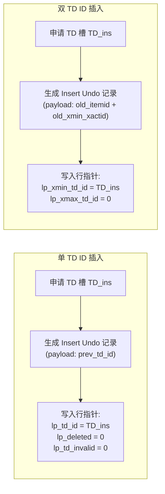
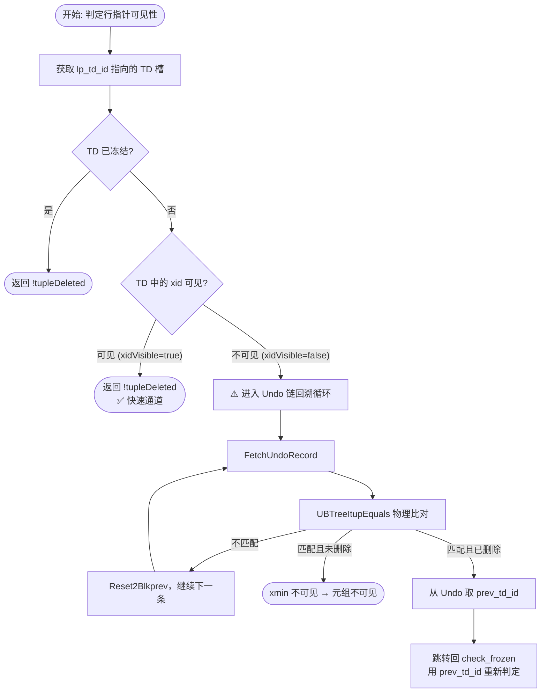
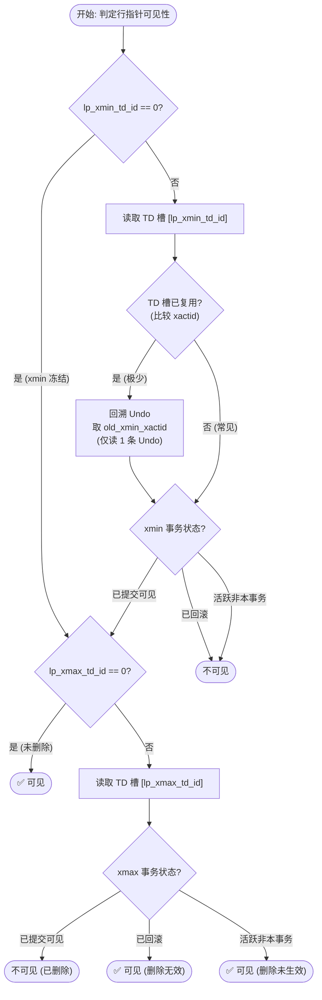

# UBTree PCR 页面格式分析：单 TD ID vs 双 TD ID 的变化与性能影响

## 1. 背景

openGauss UStore 的 `ubtreepcr` 索引使用**页面级事务目录 (TD Slots)** 来管理并发事务对索引页面的修改。每个 TD 槽记录了一个活跃事务的信息（事务号、CSN、Undo 指针等），而行指针（`UBTreeItemIdData`）通过一个 TD ID 字段引用对应的 TD 槽。

本文聚焦于 PCR 模式下行指针中 TD ID 的设计变化——从现有的**单 TD ID (8-bit `lp_td_id`)** 演进为**双 TD ID (7-bit `lp_xmin_td_id` + 7-bit `lp_xmax_td_id`)**，系统分析其带来的结构变化及对各路径的性能影响。

---

## 2. 行指针结构对比

### 2.1 现有 PCR 设计（单 TD ID）

来源：[ubtreepcr.h:71-79](file:///home/fengyao/code/openGauss-server/src/include/access/ubtreepcr.h#L71-L79)

```cpp
typedef struct UBTreeItemIdData {
    unsigned lp_off : 15,         /* 元组偏移量 */
        lp_flags : 2,             /* 行指针状态 */
        lp_td_id : 8,             /* 唯一的 TD 槽引用 (0~255) */
        lp_td_invalid : 1,        /* TD 槽是否已被复用 */
        lp_deleted : 1,           /* 元组是否已被逻辑删除 */
        lp_xmin_frozen : 1,       /* 插入事务是否已冻结 */
        lp_aligned : 4;           /* 对齐填充 */
} UBTreeItemIdData;               /* 总计 32-bit (4 字节) */
```

**特点**：
- 行指针仅有**一个** `lp_td_id` (8 位)，用于引用最近一次修改该元组的事务的 TD 槽。
- 需要额外的标志位（`lp_td_invalid`、`lp_deleted`、`lp_xmin_frozen`）来辅助判定元组状态。

### 2.2 新设计（双 TD ID）

来源：[ubtree_unified_layout_design.md:132-139](file:///home/fengyao/code/openGauss-server/ubtree_unified_layout_design.md#L132-L139)

```cpp
typedef struct UBTreeItemIdData {
    unsigned lp_off : 15,          /* 元组偏移量 (0~32767) */
             lp_flags : 2,         /* 行指针状态 */
             lp_xmin_td_id : 7,    /* 插入事务的 TD 槽 ID (0~127) */
             lp_xmax_td_id : 7,    /* 删除事务的 TD 槽 ID (0~127) */
             lp_unused : 1;        /* 预留/对齐 */
} UBTreeItemIdData;                /* 总计 32-bit (4 字节) */
```

**特点**：
- 行指针同时记录**插入事务**和**删除事务**的 TD 槽 ID。
- 消除了 `lp_td_invalid`、`lp_deleted`、`lp_xmin_frozen` 三个辅助标志位。

### 2.3 位域分配对比表

| 字段 | 现有 PCR（单 TD ID） | 新方案（双 TD ID） |
| :--- | :---: | :---: |
| `lp_off` (偏移量) | 15 位 | 15 位 |
| `lp_flags` (状态) | 2 位 | 2 位 |
| TD 引用 | `lp_td_id` = **8 位** | `lp_xmin_td_id` = **7 位** + `lp_xmax_td_id` = **7 位** |
| `lp_td_invalid` | 1 位 | ❌ 取消 |
| `lp_deleted` | 1 位 | ❌ 取消（由 `lp_xmax_td_id > 0` 代替） |
| `lp_xmin_frozen` | 1 位 | ❌ 取消（由 `lp_xmin_td_id == 0` 代替） |
| 填充/预留 | 4 位 | 1 位 |
| **合计** | **32 位** | **32 位** |

> [!IMPORTANT]
> 行指针物理大小在两种方案中保持完全一致——都是标准的 **4 字节 (32-bit)**，不会引入任何空间膨胀或对齐问题。

---

## 3. 标志位的语义变化

单 TD ID 设计需要多个辅助标志位来弥补信息缺失，双 TD ID 通过结构本身的语义天然表达了这些状态。

### 3.1 `lp_deleted` 的消除

| 场景 | 单 TD ID | 双 TD ID |
| :--- | :--- | :--- |
| 判断元组是否已被逻辑删除 | 检查 `lp_deleted == 1` | 检查 `lp_xmax_td_id > 0` |
| 删除操作 | 设置 `lp_deleted = 1` | 设置 `lp_xmax_td_id = TD_del` |
| 删除回滚 | 设置 `lp_deleted = 0` | 设置 `lp_xmax_td_id = 0` |

**分析**：双 TD ID 中 `lp_xmax_td_id > 0` 就天然表示存在一个删除操作指向某个 TD 槽，语义更明确、不可能出现 `lp_deleted` 与 `lp_td_id` 状态不一致的 bug。

### 3.2 `lp_xmin_frozen` 的消除

| 场景 | 单 TD ID | 双 TD ID |
| :--- | :--- | :--- |
| 判断插入事务是否已冻结 | 检查 `lp_xmin_frozen == 1`，或 `lp_td_id == 0` | 检查 `lp_xmin_td_id == 0` |
| 冻结操作 | 设置 `lp_xmin_frozen = 1`，`lp_td_id = 0` | 设置 `lp_xmin_td_id = 0` |

**分析**：在单 TD ID 中，`lp_xmin_frozen` 存在的原因是 `lp_td_id` 可能在删除时被覆写为删除事务的 TD，此时需要一个单独的标志来标记"原来的插入事务已冻结"。双 TD ID 中 xmin 和 xmax 是独立通道，互不干扰，因此 `lp_xmin_td_id == 0` 就能准确表达冻结语义。

### 3.3 `lp_td_invalid` 的消除

`lp_td_invalid` 在现有代码中的用途——来源：[ubtpcrtd.cpp:99](file:///home/fengyao/code/openGauss-server/src/gausskernel/storage/access/ubtreepcr/ubtpcrtd.cpp#L99)：

```cpp
// 当已提交事务的 TD 槽被强制复用时
UBTreePCRSetIndexTupleTDInvalid(itemId);
```

| 场景 | 单 TD ID | 双 TD ID |
| :--- | :--- | :--- |
| TD 槽被复用后的标记 | 设置 `lp_td_invalid = 1`，提示读路径需回溯 Undo | 无需标记。正常 Prune 流程会先将引用清零再释放 TD 槽 |
| 读路径检测 | 检查 `IsUBTreePCRTDReused(iid)` | 比较 TD 槽中当前 `xactid` 与预期值是否一致 |

**分析**：在双 TD ID 设计中，Prune 冻结 TD 槽时会遍历所有引用该槽的行指针，将 `lp_xmin_td_id` 或 `lp_xmax_td_id` 置为 `0` (Frozen)，冻结完成后 TD 槽才被释放。这消除了"行指针引用已被复用的 TD 槽"这一不一致状态的产生。极端情况下（`CompactTd` 强制复用），PCR 模式通过 Undo 链回溯来处理，不需要在行指针中存储额外标志。

---

## 4. TD 槽数量上限的变化

| 参数 | 单 TD ID (8-bit) | 双 TD ID (7-bit) |
| :--- | :--- | :--- |
| TD ID 位宽 | 8 位 | 7 位 × 2 |
| 可表达范围 | 0 ~ 255 | 0 ~ 127（每个） |
| Frozen 预留值 | `UBTreeFrozenTDSlotId = 0` | 同：`td_id = 0` 表示 Frozen |
| Invalid 预留值 | `UBTreeInvalidTDSlotId = 255` | **不再需要**。7-bit 无法表达 255 |
| **有效 TD 槽数量** | **1 ~ 128**（`UBTREE_MAX_TD_COUNT = 128`） | **1 ~ 127** |

> [!NOTE]
> 最大 TD 槽数量从 128 降低到 127，仅减少 1 个。在实际 B-Tree 工作负载中，单页面同时处于活跃状态的并发写事务通常不超过 32 个（见 `UBTREE_TD_THRESHOLD_FOR_PAGE_SWITCH = 32`），因此少 1 个对并发能力几乎无影响。

### 4.1 每个 TD 槽的物理大小（不变）

TD 槽本身的结构（`UBTreeTDData`，32 字节）在两种设计中完全相同，不受行指针位域变化的影响。

```
单个 PCR TD 槽 = xactid(8B) + combine(8B) + undoRecPtr(8B) + tdStatus(1B) + padding = 32 字节
```

---

## 5. 各操作路径的行为变化

### 5.1 插入操作 (Insert)



**变化分析**：
- **TD 槽申请**：无变化。
- **行指针写入**：单 TD ID 需要设置 3 个字段（`lp_td_id`、`lp_deleted`、`lp_td_invalid`），双 TD ID 只需设置 2 个字段（`lp_xmin_td_id`、`lp_xmax_td_id`），逻辑更简洁。
- **Undo Payload**：双 TD ID 方案的 Undo Payload 更大（保存完整的 `old_itemid` + `old_xmin_xactid`，约 12 字节 vs 单 TD ID 的 1 字节 `prev_td_id`），但这是用空间换取读路径的 $O(1)$ 性能。

**性能影响**：插入路径的性能差异**可忽略**。额外的 Undo Payload 写入增加约 11 字节，对于 SSD/NVMe 存储几乎无感。

### 5.2 删除操作 (Delete) — **核心差异点**

这是两种设计差异最大的操作路径。

#### 单 TD ID 删除

来源：[ubtpcrinsert.cpp:334](file:///home/fengyao/code/openGauss-server/src/gausskernel/storage/access/ubtreepcr/ubtpcrinsert.cpp#L334)，[ubtpcrinsert.cpp:2511](file:///home/fengyao/code/openGauss-server/src/gausskernel/storage/access/ubtreepcr/ubtpcrinsert.cpp#L2511)

```
1. 申请 TD 槽 TD_del
2. 生成 Delete Undo 记录，将行指针中原有的 lp_td_id (即 TD_ins) 作为 prev_td_id 写入 Undo Payload
3. 修改行指针：lp_td_id = TD_del，lp_deleted = 1
   ⚠️ 此时原来的插入事务 TD ID 从行指针上被覆盖丢失
```

#### 双 TD ID 删除

```
1. 申请 TD 槽 TD_del
2. 生成 Delete Undo 记录 (Payload: old_itemid 完整镜像 + old_xmin_xactid + old_xmax_xactid)
3. 修改行指针：仅设置 lp_xmax_td_id = TD_del
   ✅ lp_xmin_td_id 保持不变，原插入事务信息在行指针上完整保留
```

**变化分析**：

| 对比维度 | 单 TD ID | 双 TD ID |
| :--- | :--- | :--- |
| 行指针修改范围 | 覆写 `lp_td_id` + 设置 `lp_deleted` | 仅设置 `lp_xmax_td_id` |
| xmin 信息保留 | ❌ 被覆盖，仅在 Undo 中保留 | ✅ 在行指针上保留 |
| 信息完整性 | 依赖 Undo 链还原 xmin | 页面自包含 |

**性能影响**：删除操作本身的写路径差异**较小**，但其对后续读路径的性能影响**巨大**——因为 xmin 信息是否保留在行指针上，直接决定了读路径是否需要回溯 Undo（见 §5.3）。

### 5.3 MVCC 读可见性判定 — **最大性能差异点**

这是双 TD ID 设计带来**最显著性能提升**的路径。

#### 5.3.1 单 TD ID 的读路径

来源：[IndexTupleSatisfiesMvcc](file:///home/fengyao/code/openGauss-server/src/gausskernel/storage/access/ubtreepcr/ubtpcrsearch.cpp#L1379-L1539)



关键代码（Undo 回溯慢速路径）——行 1476~1537：

```cpp
/* tdxid invisible, check tuple visibility through undo chain */
UndoRecord *urec = New(CurrentMemoryContext)UndoRecord();
urec->SetUrp(td->undoRecPtr);
while (true) {
    FetchUndoRecord(urec, ...);           // 读取 Undo 页面（可能产生随机 I/O）
    undoItup = FetchTupleFromUndoRecord(urec);
    if (UBTreeItupEquals(itup, undoItup)) {  // CPU 密集的元组物理比对
        if (!tupleDeleted) {
            break;  // xmin 不可见
        } else {
            tupleDeleted = false;
            UBTreeUndoInfo undoInfo = FetchUndoInfoFromUndoRecord(urec);
            tdid = undoInfo->prev_td_id;  // 获取插入事务的 TD ID
            goto check_frozen;            // 跳回重新判定
        }
    }
    urec->Reset2Blkprev();  // 继续遍历 Block 内的下一条 Undo
}
```

> [!WARNING]
> **性能瓶颈**：当读事务需要判定一个已删除元组的可见性时，由于 `lp_td_id` 已被删除事务覆写，读路径**必须**进入 Undo 链回溯。该循环中涉及：
> - `FetchUndoRecord`：从 Undo 日志中读取记录，可能触发 **Undo 页面的随机 I/O**。
> - `UBTreeItupEquals`：对每条 Undo 记录中的元组进行**逐字节物理比对**，CPU 开销高。
> - 如果 TD 槽被多次复用（`changeXid = true`），循环次数可能达到 $O(N)$，其中 $N$ 为 Block 上的 Undo 链长度。

#### 5.3.2 双 TD ID 的读路径



**关键区别**：
1. **xmin 信息始终在行指针上可用**：`lp_xmin_td_id` 不会被删除操作覆写，读事务可以直接通过它找到插入事务的 TD 槽。
2. **不需要逐条遍历 Undo 链做元组比对**：即使 TD 槽被复用，由于双 TD ID 的 Undo Payload 中完整保存了 `old_xmin_xactid` 和 `old_xmax_xactid`（各 8B），读事务**只需读取当前元组关联的最新 1 条 Undo 记录**即可获取精确的历史 XID。

#### 5.3.3 读路径性能对比

| 场景 | 单 TD ID | 双 TD ID | 性能变化 |
| :--- | :--- | :--- | :--- |
| 未删除元组 + TD 未复用 | 直接页面内判定 | 直接页面内判定 | **无差异** |
| 未删除元组 + TD 已复用 | 回溯 Undo 链 $O(N)$ | 读取 1 条 Undo $O(1)$ | **⬆️ 大幅提升** |
| 已删除元组 + TD 未复用 | 回溯 Undo 链取 `prev_td_id` | 直接页面内判定（两个 TD ID 都在行指针上） | **⬆️⬆️ 显著提升** |
| 已删除元组 + TD 已复用 | 回溯整个 Block Undo 链 + 元组物理比对 $O(N)$ | 读取 1 条 Undo $O(1)$ | **⬆️⬆️⬆️ 极大提升** |

> [!IMPORTANT]
> **核心结论**：双 TD ID 将已删除元组的 MVCC 可见性判定从 $O(N)$ 的 Undo 链遍历+物理比对，降低为 $O(1)$ 的页面内直接判定或单条 Undo 读取。这是对读吞吐量影响最大的优化。

### 5.4 事务回滚 (Abort)

#### 5.4.1 插入回滚

两种方案行为基本相同：将行指针标记为失效（`LP_DEAD`），释放 TD 槽。

#### 5.4.2 删除回滚

| 步骤 | 单 TD ID | 双 TD ID |
| :--- | :--- | :--- |
| 1. 读取 Undo | 必须读取 Delete Undo 取 `prev_td_id` | 读取 Delete Undo 取 `old_itemid` 镜像 |
| 2. 恢复行指针 | 手动字段拼接：`lp_td_id = prev_td_id`，`lp_deleted = 0` | 直接覆写完整 `old_itemid` |
| 3. 一致性风险 | 多字段手动拼接，需确保 `lp_deleted`/`lp_td_invalid` 一致 | 原子覆写，无不一致风险 |

来源：[ubtpcrrollback.cpp:237](file:///home/fengyao/code/openGauss-server/src/gausskernel/storage/access/ubtreepcr/ubtpcrrollback.cpp#L237)

```cpp
// 现有单 TD ID 回滚：手动提取 prev_td_id 并拼接
uint8 prevTDid = (undoinfo->prev_td_id >= opaque->td_count) ? UBTreeFrozenTDSlotId : undoinfo->prev_td_id;
```

**性能影响**：回滚路径本身性能差异较小（都需要读 Undo），但双 TD ID 的原子覆写降低了代码复杂度和潜在 bug 风险。

### 5.5 垃圾回收与收缩 (Page Prune)

| 步骤 | 单 TD ID | 双 TD ID |
| :--- | :--- | :--- |
| 冻结已提交 TD | 遍历行指针，若 `lp_td_id == i`：<br/>• 未删除 → 设 `lp_xmin_frozen = 1`，设 `lp_td_invalid = 1`<br/>• 已删除 → 设 `LP_DEAD` | 遍历行指针：<br/>• `lp_xmin_td_id == i` → 直接设 `= 0` (Frozen)<br/>• `lp_xmax_td_id == i` → 设 `= 0` + `LP_DEAD` |
| 冻结已回滚 TD | 需先执行 Undo 回滚（`ExecuteUndoActionsForUBTreePage`） | • `lp_xmin_td_id == i` → 直接设 `LP_DEAD`<br/>• `lp_xmax_td_id == i` → 设 `= 0`，保持 `LP_NORMAL` |
| 状态机复杂度 | 高：需处理 `lp_deleted`、`lp_td_invalid`、`lp_xmin_frozen` 的组合 | 低：仅需分别处理 xmin 和 xmax 的引用清除 |

来源：[UBTreeFreezeOrInvalidIndexTuples](file:///home/fengyao/code/openGauss-server/src/gausskernel/storage/access/ubtreepcr/ubtpcrtd.cpp#L53-L103)

**性能影响**：

- **单 TD ID 的 Prune 路径**需要区分 `isFrozen = true`（物理冻结）和 `isFrozen = false`（标记无效），且对每个行指针需要判断 `IsUBTreePCRItemDeleted` 来决定是标 `LP_DEAD` 还是设 `lp_xmin_frozen`。
- **双 TD ID 的 Prune 路径**无需判断 `lp_deleted`，直接根据"该 TD 被 xmin 还是 xmax 引用"做对应清理。逻辑分支更少、缓存友好性更好。
- Prune 路径每次调用都需要遍历页面上所有行指针（$O(M)$，$M$ 为页面元组数），因此分支简化带来的收益在高频 Prune 场景下可累积。

---

## 6. Undo 记录设计的变化

### 6.1 Undo Payload 对比

| 字段 | 单 TD ID | 双 TD ID |
| :--- | :--- | :--- |
| `prev_td_id` | 1 字节（插入事务的旧 TD ID） | ❌ 不再需要 |
| `old_itemid` | ❌ 无 | 4 字节（行指针完整镜像） |
| `old_xmin_xactid` | ❌ 无 | 8 字节（旧 xmin 对应的完整事务号） |
| `old_xmax_xactid` | ❌ 无 | 8 字节（旧 xmax 对应的完整事务号，可选） |
| **Payload 总大小** | **~1 字节** + IndexTuple | **~20 字节** + IndexTuple |

> [!NOTE]
> 双 TD ID 的 Undo Payload 增大约 19 字节。这是一个合理的空间换时间权衡——用每条 Undo 记录多存约 19 字节，换取读路径从 $O(N)$ Undo 链遍历降低到 $O(1)$ 直接读取。

### 6.2 Undo 回溯流程的变化

**单 TD ID 回溯**：当 TD 槽被复用时，读路径需要沿 `undoRecPtr → blkprev` 链逐条遍历 Block 上的所有 Undo 记录，对每条记录执行 `FetchTupleFromUndoRecord` + `UBTreeItupEquals` 物理比对，直到找到匹配的记录。

**双 TD ID 回溯**：当 TD 槽被复用时，读路径只需读取当前 TD 槽的 `undoRecPtr` 指向的**最新 1 条 Undo 记录**，从其 Payload 中直接取出 `old_xmin_xactid` / `old_xmax_xactid`，即可完成历史状态恢复。

---

## 7. 性能影响总结

### 7.1 按操作路径分类

| 操作路径 | 性能变化 | 变化幅度 | 原因 |
| :--- | :--- | :--- | :--- |
| **读（未删除 + TD 未复用）** | 无变化 | — | 两种设计都走页面内快速通道 |
| **读（已删除 + TD 未复用）** | ⬆️ 大幅提升 | 消除 1 次 Undo 读取 | 单 TD ID 必须回溯 Undo 取 `prev_td_id`；双 TD ID 直接读行指针 |
| **读（TD 已复用）** | ⬆️⬆️ 极大提升 | $O(N) → O(1)$ | 消除 Undo 链遍历和元组物理比对 |
| **写（Insert）** | 基本无变化 | Undo Payload 多 ~19B | 可忽略 |
| **写（Delete）** | 微幅提升 | 少修改 1~2 个标志位 | 逻辑简化 |
| **回滚（Delete Abort）** | 微幅提升 | 原子覆写 vs 手动拼接 | 降低代码复杂度 |
| **Prune/Freeze** | 提升 | 分支更少、逻辑更清晰 | 无需判断 `lp_deleted` 决定清理路径 |

### 7.2 按资源消耗分类

| 资源维度 | 变化 | 说明 |
| :--- | :--- | :--- |
| **Undo I/O** | ⬇️⬇️ 大幅降低 | 已删除元组的读可见性判定不再需要遍历 Undo 链 |
| **CPU** | ⬇️ 降低 | 消除 `UBTreeItupEquals` 物理比对和 Undo Record 反序列化 |
| **内存分配** | ⬇️ 降低 | 减少 `UndoRecord` 对象的创建/销毁（`New`/`DELETE_EX`） |
| **Undo 存储** | ⬆️ 略增 | 每条 Undo Payload 多 ~19 字节 |
| **页面空间** | 无变化 | 行指针保持 4 字节，TD 槽保持 32 字节 |
| **TD 槽上限** | ⬇️ 微降 | 128 → 127，实际无影响 |

### 7.3 工作负载场景分析

| 工作负载 | 性能收益 | 说明 |
| :--- | :--- | :--- |
| **读密集型 (OLAP)** | ⭐⭐⭐⭐⭐ | 大量快照读扫描已删除但未 Prune 的元组，双 TD ID 消除了 Undo 回溯开销 |
| **高并发短事务 (OLTP)** | ⭐⭐⭐⭐ | TD 槽频繁复用，双 TD ID 将复用后的读开销从 $O(N)$ 降到 $O(1)$ |
| **写密集型 (Batch Insert)** | ⭐⭐ | 主要优势在于 Undo Payload 设计更健壮，写路径本身差异不大 |
| **长事务混合** | ⭐⭐⭐⭐⭐ | 长事务持有旧快照时，其他事务对已删除元组的可见性判定代价最高，双 TD ID 收益最大 |
| **频繁 DELETE 后 SELECT** | ⭐⭐⭐⭐⭐ | 这是单 TD ID 的最差场景——每次 SELECT 已删除元组都需回溯 Undo，双 TD ID 完全消除这一瓶颈 |

---

## 8. 代码改动影响面评估

基于对现有代码的分析，从单 TD ID 迁移到双 TD ID 需要修改的核心文件：

| 文件 | 改动内容 | 复杂度 |
| :--- | :--- | :--- |
| [ubtreepcr.h](file:///home/fengyao/code/openGauss-server/src/include/access/ubtreepcr.h) | 行指针结构体、所有 `lp_td_id` 相关宏、`UBTreeUndoInfoData` 结构 | 高 |
| [ubtpcrsearch.cpp](file:///home/fengyao/code/openGauss-server/src/gausskernel/storage/access/ubtreepcr/ubtpcrsearch.cpp) | `IndexTupleSatisfiesMvcc`、`IndexTupleSatisfiesDirty`、`UBTreePCRCheckKeys` | 高 |
| [ubtpcrtd.cpp](file:///home/fengyao/code/openGauss-server/src/gausskernel/storage/access/ubtreepcr/ubtpcrtd.cpp) | `UBTreeFreezeOrInvalidIndexTuples`、`UBTreePageFreezeTDSlots` | 中 |
| [ubtpcrinsert.cpp](file:///home/fengyao/code/openGauss-server/src/gausskernel/storage/access/ubtreepcr/ubtpcrinsert.cpp) | `UBTreePCRDoInsert`、`UBTreePCRDoDelete`、`PreparePCRDelete` | 高 |
| [ubtpcrrollback.cpp](file:///home/fengyao/code/openGauss-server/src/gausskernel/storage/access/ubtreepcr/ubtpcrrollback.cpp) | `ExecuteRollback`、Undo Record 解析逻辑 | 中 |
| [ubtpcrrecycle.cpp](file:///home/fengyao/code/openGauss-server/src/gausskernel/storage/access/ubtreepcr/) | Prune/Defragmentation 逻辑 | 中 |
| [pagehack.cpp](file:///home/fengyao/code/openGauss-server/contrib/pagehack/pagehack.cpp) | 页面调试输出适配 | 低 |

---

## 9. 结论

双 TD ID 设计通过在行指针中**解耦 xmin 和 xmax 的物理引用通道**，带来以下核心变化：

1. **消除了删除操作对 xmin 信息的覆盖**，使得行指针成为自包含的 MVCC 状态载体。
2. **将已删除元组的读可见性判定从 $O(N)$ 降低为 $O(1)$**，消除了 Undo 链遍历和元组物理比对的性能瓶颈。
3. **消除了 3 个辅助标志位**（`lp_deleted`、`lp_td_invalid`、`lp_xmin_frozen`），简化了状态机，降低了代码复杂度和 bug 风险。
4. **代价可控**：TD 槽上限从 128 降低到 127（无实际影响），Undo Payload 每条增大约 19 字节（合理的空间换时间权衡）。

综合而言，双 TD ID 设计在**读密集**和**高并发写后读**场景下能带来最显著的性能提升，同时在写路径上几乎不引入额外开销，是一个收益远大于代价的架构优化。
