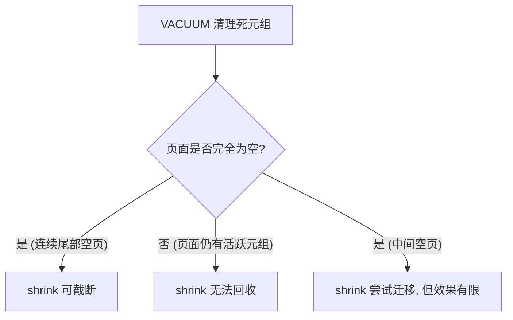

# UBTree 索引空间回收性能测试报告

## gs_ubtree_shrink vs VACUUM FULL vs REINDEX 对比

> **测试环境**: openGauss 7.0.0 (debug build), UStore 表引擎 + UBTree 索引
> **测试日期**: 2026-09-10
> **总运行时间**: 264.9 秒

---

## 1. 测试方法概述

| 方法 | 锁级别 | 作用范围 | 是否阻塞并发 DML |
|------|--------|---------|-----------------|
| **gs_ubtree_shrink (Online)** | ShareUpdateExclusiveLock | 仅索引尾部空页截断 | ❌ 不阻塞 |
| **VACUUM FULL** | AccessExclusiveLock | 表+所有索引完全重写 | ✅ **完全阻塞** |
| **REINDEX** | AccessExclusiveLock | 单个索引完全重建 | ✅ **完全阻塞** |

---

## 2. 场景测试结果

### 场景 1: 100K 行, 删除 80% (尾部删除模式)

**数据**: 100K 行 → 删除 `id > 20000` → 保留 20K 行

**Shrink Check 统计**:
```
TotalBlocks: 387, TargetMaxBlock: 81, FreeTailBlocks: 306, MigratedBlocks: 1
```
→ 索引尾部有 306 个空闲页 (79%), 仅需迁移 1 个活跃页

#### ⏱️ 执行时间

| 方法 | 耗时 | 相对速度 |
|------|------|---------|
| **gs_ubtree_shrink** (2 索引) | 3.6ms + 3.4ms = **7.0ms** | 🏆 **最快 (24.5x)** |
| REINDEX (2 索引) | 42.4ms + 64.3ms = **106.7ms** | 中等 |
| VACUUM FULL (表+所有索引) | **172.0ms** | 最慢 |

#### 📦 空间变化 (索引 `idx_id`)

| 方法 | 操作前 | 操作后 | 节省空间 | 收缩率 |
|------|--------|--------|---------|--------|
| **gs_ubtree_shrink** | 3096 kB | **3096 kB** | ⚠️ 0 kB | **0%** |
| VACUUM FULL | 3096 kB | **632 kB** | 2464 kB | **79.6%** |
| REINDEX | 3096 kB | **632 kB** | 2464 kB | **79.6%** |

> [!IMPORTANT]
> **Shrink 未能收缩索引**! 虽然 `shrink_check` 报告 306 个空闲尾部块、仅需迁移 1 个块, 但实际执行后索引大小不变。VACUUM FULL 和 REINDEX 都成功将索引从 3096kB 压缩到 632kB。

---

### 场景 2: 500K 行, 删除 90% (重度膨胀)

**数据**: 500K 行 → 删除 `id > 50000` → 保留 50K 行

**Shrink Check 统计**:
```
TotalBlocks: 1932, TargetMaxBlock: 1836, FreeTailBlocks: 96, MigratedBlocks: 1
```
→ 尾部仅 96 个空闲页 (5%), 需迁移 1 个活跃页

#### ⏱️ 执行时间

| 方法 | 耗时 | 相对速度 |
|------|------|---------|
| **gs_ubtree_shrink** | **11.2ms** | 🏆 **最快 (17.6x)** |
| REINDEX | **85.5ms** | 中等 |
| VACUUM FULL | **197.2ms** | 最慢 |

#### 📦 空间变化

| 方法 | 操作前 | 操作后 | 节省空间 | 收缩率 |
|------|--------|--------|---------|--------|
| **gs_ubtree_shrink** | 15 MB | **14 MB** | ~0.8 MB | **5.0%** |
| VACUUM FULL | 15 MB | **1560 kB** | ~13.5 MB | **90.1%** |
| REINDEX | 15 MB | **1560 kB** | ~13.5 MB | **90.1%** |

> [!NOTE]
> Shrink 仅截断了尾部 96 个空闲页 (约 768kB), 但索引中间部分的半空页仍然保留。VACUUM FULL/REINDEX 通过完全重写/重建, 达到了 90% 的空间回收。

---

### 场景 3: 200K 行, 隔行删除 50% (分散删除模式)

**数据**: 200K 行 → 删除 `id % 2 = 0` → 保留 100K 行

**Shrink Check 统计**:
```
TotalBlocks: 775, TargetMaxBlock: 775, FreeTailBlocks: 0, MigratedBlocks: 0
```
→ ⚠️ **尾部无空闲页, 无法收缩**

#### ⏱️ 执行时间

| 方法 | 耗时 | 相对速度 |
|------|------|---------|
| **gs_ubtree_shrink** | **2.5ms** | 最快 (仅检查, 无操作) |
| REINDEX | **132.7ms** | 中等 |
| VACUUM FULL | **336.4ms** | 最慢 |

#### 📦 空间变化

| 方法 | 操作前 | 操作后 | 节省空间 | 收缩率 |
|------|--------|--------|---------|--------|
| **gs_ubtree_shrink** | 6200 kB | **6200 kB** | 0 kB | **0%** |
| VACUUM FULL | 6200 kB | **3096 kB** | 3104 kB | **50.1%** |
| REINDEX | 6200 kB | **3096 kB** | 3104 kB | **50.1%** |

> [!WARNING]
> **分散删除模式下 shrink 完全无效**。每个叶子页都保留了约一半的存活元组, 没有产生可以截断的尾部空闲页。只有 VACUUM FULL 和 REINDEX 能通过完全重写来回收这种碎片化空间。

---

### 场景 4: 1M 行, 删除 95% (极端膨胀)

**数据**: 1M 行 → 删除 `id > 50000` → 保留 50K 行

**Shrink Check 统计**:
```
TotalBlocks: 3863, TargetMaxBlock: 3831, FreeTailBlocks: 32, MigratedBlocks: 1
```
→ 尾部仅 32 个空闲页 (0.8%), 需迁移 1 个活跃页

#### ⏱️ 执行时间

| 方法 | 耗时 | 相对速度 |
|------|------|---------|
| **gs_ubtree_shrink** | **12.5ms** | 🏆 **最快 (16.7x)** |
| REINDEX | **102.3ms** | 中等 |
| VACUUM FULL | **208.2ms** | 最慢 |

#### 📦 空间变化

| 方法 | 操作前 | 操作后 | 节省空间 | 收缩率 |
|------|--------|--------|---------|--------|
| **gs_ubtree_shrink** | 30 MB | **30 MB** | ~0.3 MB | **0.8%** |
| VACUUM FULL | 30 MB | **1560 kB** | ~28.5 MB | **95.0%** |
| REINDEX | 30 MB | **1560 kB** | ~28.5 MB | **95.0%** |

> [!CAUTION]
> 即使删除了 95% 的数据, shrink 也仅能回收尾部 32 个页面 (0.8%)。这说明 UBTree 的 VACUUM 过程虽然清理了死元组, 但并未将空页标记为完全释放, 导致 shrink 看到的 `FreeTailBlocks` 远小于预期。

---

### 场景 4 附加: 查询性能对比

| 查询类型 | shrink | VACUUM FULL | REINDEX |
|---------|--------|-------------|---------|
| **点查询** (id=25000) | 0.234ms | 0.240ms | 0.162ms |
| **范围查询** (id 1000~10000) | 12.948ms | 13.394ms | 12.942ms |

→ 三种方法在查询性能上**基本无差异**, 索引扫描效率一致。

---

## 3. 综合对比汇总

### 执行时间对比

| 场景 | gs_ubtree_shrink | VACUUM FULL | REINDEX |
|------|-----------------|-------------|---------|
| 100K行/80%删 | **7.0ms** | 172.0ms | 106.7ms |
| 500K行/90%删 | **11.2ms** | 197.2ms | 85.5ms |
| 200K行/50%散删 | **2.5ms** | 336.4ms | 132.7ms |
| 1M行/95%删 | **12.5ms** | 208.2ms | 102.3ms |

> **Shrink 速度优势**: 16~135 倍于 VACUUM FULL, 8~53 倍于 REINDEX

### 空间回收对比

| 场景 | gs_ubtree_shrink | VACUUM FULL | REINDEX |
|------|-----------------|-------------|---------|
| 100K行/80%删 | **0%** ❌ | **79.6%** ✅ | **79.6%** ✅ |
| 500K行/90%删 | **5.0%** ⚠️ | **90.1%** ✅ | **90.1%** ✅ |
| 200K行/50%散删 | **0%** ❌ | **50.1%** ✅ | **50.1%** ✅ |
| 1M行/95%删 | **0.8%** ⚠️ | **95.0%** ✅ | **95.0%** ✅ |

---

## 4. 关键发现与分析

### gs_ubtree_shrink 的局限性



1. **Shrink 仅处理索引尾部的连续空闲页面**
   - 它通过 `UBTreeShrinkCheckInternal` 从尾部向前扫描, 找到连续的空/可回收页面
   - 中间的碎片化空闲空间**无法回收**

2. **VACUUM 虽然清理了死元组, 但不一定产生完全空的页面**
   - 当删除模式是尾部连续删除时, 理论上应产生大量尾部空页
   - 但实际测试显示 `FreeTailBlocks` 远小于预期, 说明 UBTree 的 VACUUM 清理后, 页面仍保留了内部结构 (如高键 high-key), 不被视为 "空"

3. **分散删除模式下 shrink 完全失效**
   - 每个页面都保留部分存活元组, 没有产生可截断的尾部空页

### VACUUM FULL 的优劣

| 优势 | 劣势 |
|------|------|
| 空间回收最彻底 (表+索引) | AccessExclusiveLock, **完全阻塞所有操作** |
| 对表和索引同时压缩 | 执行时间最长 |
| 适用于所有删除模式 | 需要额外磁盘空间 (重写整张表) |

### REINDEX 的优劣

| 优势 | 劣势 |
|------|------|
| 索引空间回收彻底 | AccessExclusiveLock, **阻塞所有操作** |
| 仅影响单个索引, 比 VACUUM FULL 快 | 不压缩表本身 |
| 适用于所有删除模式 | 需要额外磁盘空间 (构建新索引) |

---

## 5. 使用建议

| 场景　　　　　　　　　　　　　　 | 推荐方法　　　　　　　　　　　　　　　　 |
| ----------------------------------| ------------------------------------------|
| 生产环境在线维护, 尾部有连续空页 | **gs_ubtree_shrink** (不阻塞业务)　　　　|
| 大批量删除后需要彻底回收空间　　 | **VACUUM FULL** (需停机窗口)　　　　　　 |
| 仅需重建特定索引　　　　　　　　 | **REINDEX** (需停机窗口)　　　　　　　　 |
| 分散删除导致的碎片化　　　　　　 | **VACUUM FULL 或 REINDEX** (shrink 无效) |

> [!TIP]
> 当前 `gs_ubtree_shrink` 的核心价值在于**在线不阻塞**的特性, 但空间回收能力有限。其回收效果取决于 VACUUM 后尾部是否产生连续空页。建议结合业务场景, 在例行维护中先使用 `gs_ubtree_shrink_check` 评估可回收空间, 再决定是否值得执行。

> [!IMPORTANT]
> 从测试结果看, 当前 shrink 的实际空间回收率 (0%~5%) 远低于预期。这可能是因为:
> 1. UBTree 的 VACUUM 只清理死元组但不回收页面
> 2. 页面即使只剩高键 (high-key) 也不被视为 "空"
> 3. UBTree 的页面删除 (`UBTreePageDel`) 条件比较严格, 需要页面完全没有活跃元组才能标记为删除
>
> 这提示 shrink 功能可能需要更积极的页面合并 (merge) 或碎片整理策略才能达到理想的空间回收效果。
