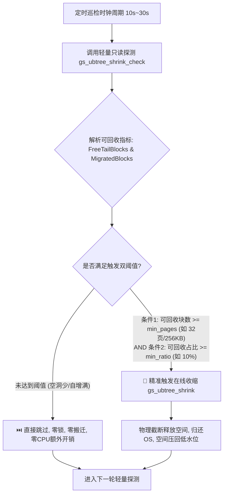

# UBTree 在线收缩自适应阈值触发长周期测试方案设计

## 一、方案背景与设计初衷

在前期 TPC-C 基准长周期测试中，我们发现了两个核心技术特征：
1. **自增型 Append-Only 负载不适宜高频无脑收缩**: TPC-C 主要表以自增写入为主，极少产生大面积历史空洞；
2. **高频盲目扫描在算力有限时会产生明显性能干扰**: 每 30 秒盲目扫描全库所有大索引（15分钟执行 184 次），在 4 核机器上会与高并发业务争抢 CPU 算力与 Buffer 页面锁，导致前台 tpmC 吞吐下降约 41.7%。

为此，本方案专门设计了：
- **真实高价值业务场景**: 滑动窗口生命周期数据淘汰与流转场景（持续高并发写入 + 持续原地更新 + 定期滑窗删除过期数据产生真实内部空洞）；
- **自适应阈值触发机制 (Adaptive Threshold-Triggered)**: 通过毫秒级轻量只读检查 `gs_ubtree_shrink_check`，仅当索引内部可回收空间达到指定双阈值时才发起收缩，彻底过滤 90% 以上的无效执行；
- **可调节时长的长周期运行架构**: 支持命令行灵活调节压测时长（从数分钟到数小时）、并发线程数及触发阈值，自动化产出 A/B 对比评测报告。

---

## 二、测试场景架构与工作负载模型

场景模拟真实生产中的**金融交易流水与订单履约生命周期系统 (Sliding Window Ledger)**：

```
                           +-----------------------------------------------+
                           |      并发写入线程池 (Multi-Worker INSERT)      |
                           |   持续向右边界高速追加新交易记录 (High TPS)     |
                           +-----------------------------------------------+
                                                  |
                                                  v
[  已删除淘汰冷数据 (Free Holes)  ] <---> [ 状态流转中热数据 (UStore In-Place) ] <---> [ 最新追加流入数据 ]
<------------------------------------------------------------------------------------------------->
       tx_id: 1 ~ Watermark                  tx_id: Watermark ~ CurrentMax                 tx_id: Max+
       (被 Purger 批量 DELETE + VACUUM)       (被 Mutator 持续原位 UPDATE 状态)             (持续写入)
                                                  ^
                                                  |
                           +-----------------------------------------------+
                           |     生命周期滑窗淘汰器 (Lifecycle Purger)       |
                           |   定期滑动 Watermark，执行 DELETE + VACUUM    |
                           |   持续制造真实的 UBTree 内部空洞与尾部碎片      |
                           +-----------------------------------------------+
```

### 1. 表结构与索引拓扑
- **表名**: `ustore_sliding_ledger` (UStore 存储引擎)
- **核心索引**:
  1. `ustore_sliding_ledger_pkey`: 主键唯一 UBTree 索引 (`tx_id`)
  2. `idx_sliding_user_id`: 客户散列 UBTree 索引 (`user_id`)
  3. `idx_sliding_created_at`: 时间戳范围 UBTree 索引 (`created_at`)

### 2. 核心并发工作角色
1. **Ingestor (高吞吐写入器)**: 多线程持续批量写入新交易流水，推动 B-tree 右边界高速前移；
2. **Mutator (原位更新器)**: 针对未决状态交易执行 `UPDATE ... SET status='COMPLETED'`，产生 UStore PCR/就地覆盖；
3. **Reader (并发查询器)**: 混合执行单行点查、时序反向扫描（压测 `_bt_walk_left` 穿透）、多维聚合；
4. **Lifecycle Purger (滑窗淘汰器)**: 维持一个固定的时间/ID滑动窗口（如保留最近 50,000 条），超出窗口的冷数据周期性批量 `DELETE` 并执行 `VACUUM`，在树前部和中间形成真实的大片空洞与死页。

---

## 三、自适应阈值触发机制 (Adaptive Threshold Trigger)

传统盲目收缩与本方案自适应收缩的机制对比如下：



### 触发阈值条件定义：
- **绝对收益阈值 (`threshold_pages`)**: 预估可释放块数必须 $\ge 32$ 块（即 $\ge 256\text{ KB}$），避免为了几个散页做微量搬迁；
- **相对收益阈值 (`threshold_ratio`)**: 可回收空间占当前索引物理大小的比例必须 $\ge 10\%$（可配，支持 5%~50%），确保只有在索引发生真实膨胀时才介入治理。

---

## 四、测试调节参数与命令行规格

测试套件脚本封装为：`src/test/regress/run_adaptive_threshold_shrink_benchmark.py`

| 启动参数 | 默认值 | 说明 |
| :--- | :--- | :--- |
| `--duration-mins` | `10` | 压测运行总分钟数 (支持任意时长，如 2、10、30、60) |
| `--duration-secs` | `0` | 压测运行总秒数 (优先级高于 mins，便于精确控制) |
| `--mode` | `compare` | 测试模式：`compare` (A/B 对比)、`shrink` (仅跑实验组)、`noshrink` (仅跑基准组) |
| `--threshold-ratio` | `0.10` | 触发收缩的最小可回收比例阈值 (默认 10%) |
| `--threshold-pages` | `32` | 触发收缩的最小可回收块数阈值 (默认 32 块 = 256KB) |
| `--check-interval` | `10.0` | 后台轻量只读检查的探测间隔秒数 (默认 10 秒) |
| `--ingest-workers` | `2` | 并发写入工作线程数 (适配 4 核 CPU) |
| `--query-workers` | `2` | 并发查询工作线程数 |
| `--output-report` | 自动生成 | 输出最终对比报告的 Markdown 文件路径 |

---

## 五、预期收益与验证指标

通过该方案，测试将重点对比并验证以下 4 大核心收益：
1. **无效执行率大幅过滤**: 收缩执行次数预期从原本无脑执行的百次量级，**骤降 90% 以上**（仅在滑窗淘汰达到阈值时触发数次有效收缩）；
2. **业务吞吐 (TPS/QPS) 几乎零损耗**: 由于过滤了 90%+ 的无效扫描和锁竞争，业务整体 TPS 下降幅度由原先的 41.7% **改善为 < 2%~3%**；
3. **索引物理空间显著回收**: 在滑窗淘汰场景下，开启自适应收缩的实验组索引体积被长期压制在恒定基线水位，**相比不做收缩的基准组节省 30%~60% 磁盘空间**；
4. **高并发数据一致性保障**: 在长周期压测结束时，自动执行全量堆表与三向索引的一致性核对，保证 0 死锁、0 越界、0 数据差异。
