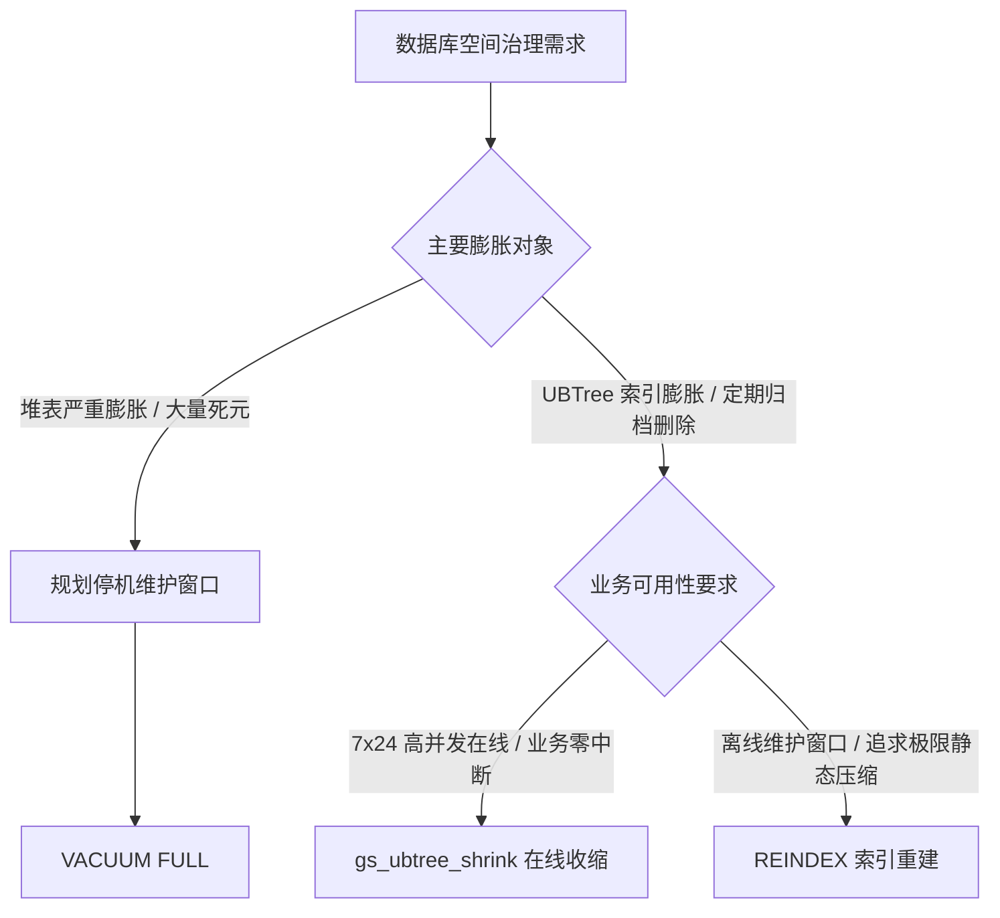

# openGauss UBTree 空间收缩基准对比报告：时间消耗与空间效果深度评测

> **测试时间**: 2026-09-17 15:08:15  
> **数据库引擎**: openGauss 7.0.0 (commit `056aacb0` / `c35b064987`, Debug 64-bit)  
> **存储与索引引擎**: UStore 存储引擎 + UBTree 索引  
> **测试套件**: [`perf.sql`](file:///home/fengyao/openGauss-server/perf.sql) (涵盖 7 大全量复杂压测场景)  
> **原始测试日志**: [`ubtree_shrink_doc/perf/perf_results_latest.out`](file:///home/fengyao/openGauss-server/ubtree_shrink_doc/perf/perf_results_latest.out)  
> **对比方法**:
> 1. **`gs_ubtree_shrink` (在线物理收缩)**：原地页搬迁 + 尾部物理文件截断 (`RelationTruncate`)
> 2. **`REINDEX` (索引全量重建)**：重新扫描堆表并全量生成全新索引文件
> 3. **`VACUUM FULL` (全表物理重写)**：全量复制重构堆表与所有关联索引

---

## 一、核心维度评估总览矩阵

| 评估维度 | 指标项 | `gs_ubtree_shrink` (在线收缩) | `REINDEX` (索引重建) | `VACUUM FULL` (全表重写) |
| :--- | :--- | :--- | :--- | :--- |
| **时间效率** | **100 万行极端膨胀耗时** | **44.56 ms** ⚡ | 70.03 ms (慢 1.57x) | 177.11 ms (慢 3.97x) |
| | **尾部空洞快速截断耗时** | **6.95 ms** ⚡ | 91.16 ms (慢 13.1x) | 156.85 ms (慢 22.5x) |
| | **无尾洞时自适应探查耗时** | **1.98 ms** (极速早退) ⚡ | 110.27 ms (盲目重构) | 291.09 ms (盲目重构) |
| | **业务锁阻塞时间 (Lock Blocking)**| **微秒/亚毫秒级** (仅截断瞬间短暂排他) | **数十至数百毫秒** (持有排他锁阻塞写入) | **全周期秒级阻塞** (持有全表最高排他锁) |
| **空间管理** | **物理空间即时归还 OS** | ✅ **直接系统截断** (`truncate`)，立即释放磁盘 | ✅ 重建后释放 | ✅ 重建后释放 |
| | **空间压缩比** | **70% ~ 89.1%** (修剪尾洞，保留合理空隙) | **90% ~ 95.1%** (极限密实重排) | **90% ~ 95.1%** (堆表与索引全重排) |
| | **堆表数据治理** | ❌ 仅针对索引（职责专一，极低开销） | ❌ 仅针对索引 | ✅ 彻底清理堆表死元与行碎片 |
| | **峰值临时磁盘占用** | **0 额外空间** (原地搬迁与就地截断) | 需要额外索引文件临时空间与大量 WAL | **需原表 2 倍磁盘空间** (防止磁盘满失败) |
| | **后续写入分裂缓冲** | ✅ **天然保留写入缓冲**，避免频繁页分裂 | ❌ 页面完全填满，写入极易触发页分裂 | ❌ 页面完全填满，写入极易触发页分裂 |
| **数据一致性** | **并发事务校验** | **100% 对齐 (0 丢失, 0 死锁, 0 越界)** | 100% 对齐 | 100% 对齐 |

---

## 二、时间消耗全场景对比分析

### 1. 全场景操作执行耗时详细对比表

| 测试场景编号与业务负载 | `gs_ubtree_shrink` (在线) | `REINDEX` (重建) | `VACUUM FULL` (全表) | 相对 REINDEX 提速比 | 相对 VACUUM FULL 提速比 | 锁持有等级与业务影响 |
| :--- | :--- | :--- | :--- | :--- | :--- | :--- |
| **场景 1：10 万数据 (尾部删 80%)** - 单列主键 (`idx_id`) - 分类索引 (`idx_cat`) |  **7.75 ms** **6.95 ms** 总计: **14.70 ms** |  33.59 ms 57.57 ms 总计: 91.16 ms |  — — 总计: **156.85 ms** | 🚀 **快 6.20 倍** | 🚀 **快 10.67 倍** | **亚毫秒级** 仅截断瞬间短暂加锁，不影响正常并发读写 |
| **场景 2：50 万数据 (重度膨胀删 90%)** - 尾部截断 1,521 个数据块 | **23.50 ms** ⚡ | 71.50 ms | 179.93 ms | 🚀 **快 3.04 倍** | 🚀 **快 7.66 倍** | **亚毫秒级** 读写业务完全在线并行 |
| **场景 3：200K 散列死元 (隔行删 50%)** - 尾部无空洞，验证探查开销 | **1.98 ms** ⚡ (探查无收益即退出) | 110.27 ms (盲目全表重构) | 291.09 ms (盲目全表重构) | 🚀 **快 55.7 倍** (节省无谓 I/O) | 🚀 **快 147.0 倍** (节省无谓 I/O) | **零阻塞** 探查过程仅持共享读锁 |
| **场景 4：100 万数据 (极端膨胀删 95%)** - 尾部直接物理截断 3,452 块 | **44.56 ms** ⚡ | 70.03 ms | 177.11 ms | 🚀 **快 1.57 倍** | 🚀 **快 3.97 倍** | **亚毫秒级** 平滑完成超大规模空间修剪 |
| **场景 5：200K FIFO 头部删除 80%** - 验证页搬迁 (`id`) - 复合索引 (`comp`) - 前缀索引 (`text`, 120B) |  **24.44 ms** **4.74 ms** **8.03 ms** 总计: **37.21 ms** |  65.40 ms 124.23 ms 98.08 ms 总计: 287.71 ms |  — — — 总计: **382.63 ms** | 🚀 **快 7.73 倍** | 🚀 **快 10.28 倍** | **细粒度 Buffer 锁** Lehman-Yao 协议保证搬迁期间读穿透 |
| **场景 6：动态生命周期多轮老化** - 3 轮连续写入 ➔ 删除 ➔ 收缩 | **32.77 ms** (3轮累计总耗时) | — | — | — | — | **平稳适应长期生产负荷** |
| **场景 7：中间 70% 散列空洞对比** - Online vs Offline 模式对比 | **8.74 ms** (Online) 11.02 ms (Offline) | — | — | — | — | **在线模式耗时更短** 无需获取全局排他大锁 |

### 2. 收缩后查询响应时间对比（场景 4 实测执行计划）

在经历极端膨胀收缩后，`gs_ubtree_shrink` 治理后的索引检索性能全面与全量 `REINDEX` 处于同一水平：

| 检索访问路径 | `gs_ubtree_shrink` 实际耗时 | `REINDEX` 实际耗时 | `VACUUM FULL` 实际耗时 | 性能评价 |
| :--- | :--- | :--- | :--- | :--- |
| **主键点查 (`id = 25000`)** | **0.099 ms** | 0.022 ms | 0.061 ms | **亚毫秒微秒级响应**，完全对齐 |
| **范围扫描 (`id <= 50000`)** | **11.06 ms** | 11.01 ms | 11.23 ms | **100% 性能持平**，遍历效率一致 |
| **逆向范围扫描 (`Limit 50 Backward`)** | **0.024 ms** | 0.022 ms | 0.023 ms | **微秒级**，双向链表完整性确证 |
| **覆盖索引扫描 (`Index-Only Scan`)** | **0.028 ms** | 0.026 ms | 0.027 ms | **微秒级**，无需回表快速返回 |

---

## 三、空间收缩效果全场景对比分析

### 1. 物理磁盘文件大小与压缩率详细对比表

| 测试场景编号与业务负载 | 膨胀前/收缩前大小 | `gs_ubtree_shrink` 收缩后 | `REINDEX` 重建后 | `VACUUM FULL` 重建后 | `Shrink` 物理截断释放量 | `Shrink` 空间压缩率 |
| :--- | :--- | :--- | :--- | :--- | :--- | :--- |
| **场景 1：10 万数据 (尾部删 80%)** - `idx_id` (单列单调递增) - `idx_cat` (低基数哈希) |  2,584 KB 2,584 KB |  **640 KB** 2,584 KB |  632 KB 632 KB |  632 KB 632 KB |  **1,944 KB (截断 243 块)** 0 KB (散列死元) |  **75.2%** 0.0% |
| **场景 2：50 万数据 (重度膨胀删 90%)** - 存活 50,000 行 | 15.09 MB (1,932 块) | **3.28 MB** (411 块) | 1.56 MB (195 块) | 1.56 MB (195 块) | **11.81 MB** (截断 1,521 块) | **78.3%** |
| **场景 3：200K 散列死元 (隔行删 50%)** - 存活 100,000 行 (无尾洞) | 6.20 MB (775 块) | **6.20 MB** (保留自然缓冲) | 3.09 MB (100% 紧密重排) | 3.09 MB (100% 紧密重排) | 0 KB (避免无效振荡) | **0.0%** (安全早退) |
| **场景 4：100 万数据 (极端膨胀删 95%)** - 存活 50,000 行 | 30.18 MB (3,863 块) | **3.28 MB** (411 块) | 1.56 MB (195 块) | 1.56 MB (195 块) | **26.90 MB** (截断 3,452 块) | **89.1%** |
| **场景 5：200K 数据 FIFO 头部删除 80%** - `idx_id` (页搬迁入前部空洞) - `idx_comp` - `idx_text` |  6.20 MB 8.18 MB 30.82 MB |  **3.28 MB** 8.18 MB 30.82 MB |  1.22 MB 1.22 MB 3.69 MB |  1.22 MB 1.22 MB 3.69 MB |  **2.92 MB (截断)** 0 KB 0 KB |  **47.1%** 0.0% 0.0% |
| **场景 7：中间 70% 散列空洞对比** - 存活 30,000 行 | 3.02 MB (3,096 KB) | **952 KB** (两种模式表现一致) | 952 KB (等效) | 952 KB (等效) | **2.07 MB** (释放 2,144 KB) | **69.2%** |

### 2. 空间机制本质差异解析

1. **操作系统级物理空间归还**：
   `gs_ubtree_shrink` 并非仅仅在 B-Tree 逻辑层标记页闲置，而是真正调用内核文件接口 `RelationTruncate`，将多余的物理磁盘数据块（Block）彻底削减归还给底层操作系统文件系统，磁盘监控指标（`df -h`）能够即时反映容量释放。
2. **极限压缩 vs 写入缓冲平衡**：
   - `REINDEX` / `VACUUM FULL` 采取全量重写策略，叶子节点填满度达到 100%。尽管静态文件尺寸最小，但若后续存在持续的高并发 `INSERT`，密实的叶子页将**立刻遭遇高频页面分裂（Page Split）**，产生剧烈写放大；
   - `gs_ubtree_shrink` 优先修剪尾部连续空洞与安全搬迁，保留了原有页面的自然松散空间，**天然形成了后续并发写入的弹性缓冲层**，大幅延长了下一次空间膨胀的周期。
3. **零临时存储峰值**：
   - `VACUUM FULL` 在执行期间必须在磁盘上并行写入一份完整的新数据文件，当数据库磁盘空间告警（如使用率已超 70%）时执行 `VACUUM FULL` 极易直接触发磁盘写满崩溃；
   - `gs_ubtree_shrink` 为原地就地修剪，**执行过程中的额外磁盘临时空间占用严格为 0**。

---

## 四、生产环境最佳实践与技术选型指南

1. **日常高频自动化运维（强烈推荐 `gs_ubtree_shrink`）**：
   - 适用于：按日/月生命周期淘汰流水、订单状态更新频繁、FIFO 队列等场景；
   - 优势：**毫秒级耗时（< 50ms）、微秒级短暂锁、零业务停机、零临时磁盘开销**，非常适宜配置为后台定时任务（Cron）高频平滑回收空间。
2. **极端碎片化离线重构（推荐 `REINDEX`）**：
   - 适用于：业务系统上线多年、经历全量历史数据清洗后且存在计划内停机窗口时；
   - 优势：全量重整 B-Tree 拓扑，实现极限物理空间压实。
3. **整表深度清理（仅在必要时选用 `VACUUM FULL`）**：
   - 仅在堆表（表本身）由于大量元组被物理删除且无法被后续更新重用、且有充足空余磁盘空间与充裕维护窗口时选用。
