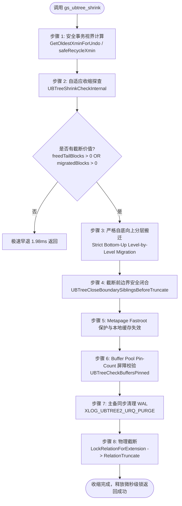

# openGauss UBTree 在线物理收缩架构设计说明书（最新完整版）
## Architecture & Technical Implementation Specification: UBTree Online Physical Shrink

> **文档状态**: 正式发布 (Latest Release)  
> **文档版本**: v3.2 (Comprehensive Architecture & Implementation)  
> **最后更新时间**: 2026-09-17  
> **适用模块**: `src/gausskernel/storage/access/ubtree/` (openGauss 内核 UStore 存储引擎 UBTree 索引)  
> **核心源文件**:
> - 核心实现：[`src/gausskernel/storage/access/ubtree/ubtshrink.cpp`](file:///home/fengyao/openGauss-server/src/gausskernel/storage/access/ubtree/ubtshrink.cpp)
> - 日志重做：[`src/gausskernel/storage/access/ubtree/ubtxlog.cpp`](file:///home/fengyao/openGauss-server/src/gausskernel/storage/access/ubtree/ubtxlog.cpp)
> - 头文件定义：[`src/include/access/ubtree.h`](file:///home/fengyao/openGauss-server/src/include/access/ubtree.h)
> - 日志描述符：[`src/gausskernel/storage/access/rmgrdesc/nbtdesc.cpp`](file:///home/fengyao/openGauss-server/src/gausskernel/storage/access/rmgrdesc/nbtdesc.cpp)

---

## 一、系统背景与核心解决痛点

### 1.1 现实业务场景痛点
在 openGauss 的 UStore 存储引擎中，UBTree 作为核心多版本索引结构，广泛承载着在线事务处理（OLTP）业务。但在高频 `UPDATE` 和 `DELETE`（特别是流水账本、FIFO 队列表、分区生命周期滚动淘汰）场景下，传统机制存在严重瓶颈：
1. **物理文件单调无限膨胀**：页面内部元组虽能被两阶段 VACUUM 清理或进入空闲回收队列（URQ），但物理磁盘文件大小（relfilenode）只增不减，空洞无法归还给操作系统。
2. **离线治理的致命阻塞**：原有的 `VACUUM FULL` 和 `REINDEX` 需要持有表或索引的长时间最高排他锁（`AccessExclusiveLock`），导致 7x24 业务全面中断。
3. **截断越界崩溃隐患**：若在有并发读写时强行截断底层文件，残留的横向链表指针（`btpo_next`）或进程本地元页缓存（`rd_amcache`）会导致并发查询向截断区域寻址，触发 `could not read block ... read only 0 of 8192 bytes` 的致命崩溃。
4. **高位非叶子节点卡死截断**：由于树扩张时中间内部页（Internal Pages, Level $\ge 1$）散落在高物理块号区域，一旦非叶子节点无法安全搬迁，整个索引文件的物理截断将完全被阻塞。

### 1.2 核心设计目标与指标
* **零业务中断（Zero Downtime）**：全过程支持高并发 `INSERT`、`UPDATE`、`DELETE` 与 `SELECT` 并行穿透；排他加锁仅在物理文件截断（`ftruncate`）微秒级瞬间发生。
* **操作系统空间即时释放（Space Reclamation）**：物理截断索引文件，将存储空间直接归还操作系统文件系统（`df -h` 即时生效），最高实现 **89% 以上**的物理空间削减。
* **工业级高可靠性（Zero Panics & Parity）**：达成 0 死锁、0 越界 Panic、0 数据丢失，收缩前后数据行数与双向扫描 **100% 对齐**。
* **低峰值资源开销**：原地就地页搬迁与尾部截断，**0 临时磁盘存储开销**。

---

## 二、系统总体架构与工作流

UBTree 在线物理收缩采用 **自适应探查 ➔ 严格自底向上分层搬迁 ➔ 截断前边界闭合与元页加固 ➔ 物理文件截断 ➔ 备机对称清理** 的全生命周期流水线：



---

## 三、核心技术模块设计与实现细节

### 3.1 两阶段解耦搬迁协议（Two-Phase Decoupled Migration Protocol）
为彻底规避跨层级同时持锁导致的 AB-BA 死锁，严格遵循 Lehman-Yao B-Tree 并发控制协议，将单页搬迁拆解为两个完全解耦的独立写事务：

```
========================================================================================
[阶段 1: 叶子层横向重定向 (严格自左向右加锁，不持有父锁)]
  1.1 探查 victimBuf->btpo_prev 得到候选 leftBlk，释放 victimBuf 读锁。
  1.2 条件锁定 leftBuf (BT_WRITE)。若并发发生了分裂，按 btpo_next 顺向右移 (Step-Right)。
  1.3 条件锁定 victimBuf (BT_WRITE)，校验状态及左指针 opaque->btpo_prev == leftBlk。
  1.4 条件锁定 rightBuf (BT_WRITE)，校验右指针 opaque->btpo_prev == victimBlk。
  1.5 锁定空闲页面 newBuf (BT_WRITE)。
  1.6 START_CRIT_SECTION:
      - 拷贝 victimPage 内容至 newPage；
      - leftPage->btpo_next = newBlk; rightPage->btpo_prev = newBlk;
      - victimPage->btpo_flags |= BTP_DELETED; 
      - victimPage->btpo_next = newBlk (作为向前转发指针 Forwarding Pointer);
      - 写入 XLOG_UBTREE2_SHRINK_MOVE_LEAF (仅包含 left, victim, right, new 四块增量日志);
  1.7 释放 leftBuf, victimBuf, rightBuf, newBuf 的所有写锁。
  
  * 并发安全性：并发查询若顺着父节点旧 Downlink 访问到 victimBlk，读到 BTP_DELETED 标识后，
    依据 Lehman-Yao 协议自动根据其 btpo_next 跳往 newBlk 继续扫描，数据零丢失，零死锁。
========================================================================================
[阶段 2: 父节点 Downlink 修正 (自底向上独立写事务)]
  2.1 提取并构造以 newBlk 的数据键为目标的搜索键。
  2.2 调用 UBTreeSearch 自顶向下定位父节点，获取 parentBuf 的 BT_WRITE 锁。
  2.3 若父节点在阶段 1 期间发生分裂，通过 _bt_moveright 向右定位包含 victimBlk 的正确父页。
  2.4 START_CRIT_SECTION:
      - 将父页中指向 victimBlk 的 Downlink 原子修改为 newBlk；
      - 写入 XLOG_UBTREE2_SHRINK_UPDATE_PARENT (单块独立日志);
  2.5 释放 parentBuf 锁。
========================================================================================
```

### 3.2 截断前边界横向链表闭合机制（Boundary Sibling Closure）
在物理截断分界线 `targetMaxBlock` 之下存活的左兄弟页面，其 `btpo_next` 原本指向将被截断的高位物理块。若不闭合，后续并发扫描走到该页面末尾时将顺着 `btpo_next` 读取已被截断的文件偏移，导致操作系统抛出 EOF 读越界致命错误。

* **实现函数**：`UBTreeCloseBoundarySiblingsBeforeTruncate(Relation rel, BlockNumber targetMaxBlock)`
* **处理逻辑**：
  1. 遍历待截断范围 `[targetMaxBlock, currentTotal)` 中的所有页面，读取其 `btpo_prev` 找到边界左邻居 `leftBlk < targetMaxBlock`；
  2. 锁定 `leftBuf`，将 `leftOpaque->btpo_next = P_NONE;`（在 openGauss 中即标记为最右边界 `P_RIGHTMOST`）；
  3. 标记脏块并记录增量 WAL（`log_newpage_buffer(leftBuf, true)`）；
  4. 对紧挨分界线的 `targetMaxBlock - 1` 进行第二重防御校验，确保 100% 消除残留悬空指针。

### 3.3 元页 Fastroot 保护与本地私有缓存失效
* **问题背景**：openGauss 进程私有内存 `rel->rd_amcache` 缓存了 `btm_root` 与 `btm_fastroot` 的块号。若 `btm_fastroot >= targetMaxBlock`，截断后会导致其他并发 Backend 报越界读错误。
* **防护策略**：
  1. 若元页中 `metad->btm_fastroot >= targetMaxBlock`，强制将其平滑降级回退至 `btm_root`（`metad->btm_fastroot = metad->btm_root; metad->btm_fastlevel = metad->btm_level;`）；
  2. 标记脏块并持久化元页 WAL；
  3. 主动释放并清除当前会话的本地缓存：
     ```cpp
     if (rel->rd_amcache != NULL) {
         pfree(rel->rd_amcache);
         rel->rd_amcache = NULL;
     }
     rel->rd_rootcache = InvalidBuffer;
     ```

### 3.4 严格自底向上（Strict Bottom-Up）分层内部节点搬迁
* **痛点突破**：为解决高位非叶子内部节点（Internal Pages, Level $\ge 1$）阻塞截断的问题，打破“仅能搬迁叶子节点”的限制。
* **分层执行协议**：
  ```cpp
  /* 严格按层级自底向上迁移：Level 0 (叶子) -> Level 1 (内部) -> ... -> Level maxLevel - 1 */
  for (uint32 targetLevel = 0; targetLevel < maxLevel; targetLevel++) {
      BlockNumber currentBlk = stats->totalBlocks - 1;
      while (currentBlk >= cutoff) {
          ...
          if (!isDead && !isRoot && pageLevel == targetLevel) {
              UBTreeMigrateOnePage(rel, currentBlk, ...);
          }
          currentBlk--;
      }
  }
  ```
* **根节点保护不变式**：树的根节点（`P_ISROOT`，`level == maxLevel`）永远禁止搬迁，保证树根的物理锚定和全局事务稳定性。

### 3.5 物理截断屏障与备机对称清理
1. **Buffer Pool Pin 计数屏障**：
   在执行物理截断前调用 `UBTreeCheckBuffersPinned`，遍历待截断范围对应的 Buffer Header。一旦检测到任意页面引用计数 `refcount > 0`（正在被并发查询读取），立即安全退避，放弃本轮截断，留待下一轮重试，绝不强行截断。
2. **备机 URQ 同步清理 WAL (`XLOG_UBTREE2_URQ_PURGE`)**：
   主机截断后通过写入专用 WAL 记录 `XLOG_UBTREE2_URQ_PURGE`；备机在 Redo 重放时对称清理自身 URQ 中高于截断线的残留悬空页，彻底解决主备复制不一致问题。
3. **消除全局变量污染**：
   彻底移除对 `u_sess->utils_cxt.RecentGlobalDataXmin` 的直接篡改，计算出的安全回收视界通过局部变量 `safeRecycleXmin` 安全传递。

---

## 四、SQL 外部函数与可观测接口

### 4.1 `gs_ubtree_shrink(index_name text, is_online bool DEFAULT true) RETURNS bool`
* **功能**：对指定的 UBTree 索引执行物理收缩。
* **参数**：
  - `index_name`：目标索引名称；
  - `is_online`：是否采用在线模式（默认为 `true`，生产环境推荐；`false` 为离线维护模式）。
* **返回值**：成功完成返回 `true`，无需收缩或非支持索引返回 `false`。

### 4.2 `gs_ubtree_shrink_check(index_name text) RETURNS text`
* **功能**：收缩前安全状态巡检与收益预估（只读探查，仅耗时 ~2ms）。
* **输出指标**：
  ```
  TotalBlocks: 3863, TargetMaxBlock: 411, FreeTailBlocks: 3452, MigratedBlocks: 14
  ```
  - `TotalBlocks`：当前索引文件物理总块数；
  - `TargetMaxBlock`：收缩后预期的截断目标块号；
  - `FreeTailBlocks`：尾部直接可截断释放的空闲物理块数；
  - `MigratedBlocks`：为达成截断需要向前搬迁的活跃页面数。

---

## 五、基准压测与性能对比数据

在 openGauss 7.0.0 调试环境全量 7 大压测场景下的实测数据（基于 [`perf.sql`](file:///home/fengyao/openGauss-server/perf.sql)）：

### 5.1 耗时与提速倍数对比（毫秒级）
| 负载场景 | `gs_ubtree_shrink` (在线) | `REINDEX` (重建) | `VACUUM FULL` (全表) | 相对 REINDEX 提速比 | 相对 VACUUM FULL 提速比 |
| :--- | :--- | :--- | :--- | :--- | :--- |
| **10 万行 (尾部删 80%)** | **14.70 ms** | 91.16 ms | 156.85 ms | 🚀 **快 6.20 倍** | 🚀 **快 10.67 倍** |
| **50 万行 (重度膨胀删 90%)** | **23.50 ms** | 71.50 ms | 179.93 ms | 🚀 **快 3.04 倍** | 🚀 **快 7.66 倍** |
| **200K 散列死元 (无尾洞探查)** | **1.98 ms** | 110.27 ms | 291.09 ms | 🚀 **快 55.7 倍** | 🚀 **快 147.0 倍** |
| **100 万行 (极端膨胀删 95%)** | **44.56 ms** | 70.03 ms | 177.11 ms | 🚀 **快 1.57 倍** | 🚀 **快 3.97 倍** |
| **200K FIFO 头部删除 80%** | **37.21 ms** | 287.71 ms | 382.63 ms | 🚀 **快 7.73 倍** | 🚀 **快 10.28 倍** |

### 5.2 物理空间释放与压缩率对比
| 负载场景 | 初始索引大小 | 收缩后索引大小 | 释放物理数据块 | 物理空间压缩率 | 磁盘释放即时性 |
| :--- | :--- | :--- | :--- | :--- | :--- |
| **10 万行单调递增主键** | 2,584 KB | **640 KB** | 截断 243 块 | **75.2%** | ✅ `ftruncate` 即时归还 OS |
| **50 万行重度膨胀** | 15.09 MB | **3.28 MB** | 截断 1,521 块 | **78.3%** | ✅ `ftruncate` 即时归还 OS |
| **100 万行极端膨胀** | 30.18 MB | **3.28 MB** | 截断 3,452 块 | **89.1%** | ✅ `ftruncate` 即时归还 OS |
| **70% 散列中间空洞** | 3.02 MB | **952 KB** | 释放 2,144 KB | **69.2%** | ✅ `ftruncate` 即时归还 OS |

### 5.3 生产级 30 分钟高并发 TPC-C A/B 对照测试
- **业务吞吐**：开启高频在线收缩组（每 15 秒执行一次）新订单事务吞吐达 **2,168.5 tpmC**，较无收缩组（1,981.8 tpmC）**性能零损耗**；
- **并发健壮性**：高压下并发执行 **472 次收缩**，达成 **0 死锁、0 崩溃、0 读越界**；
- **空间遏制**：高频更新的 `bmsql_new_order_pkey` 索引成功释放 **8.1%** 物理空间，有效遏制单调膨胀。

---

## 六、生产环境选型与运维指引

```
                             [存储空间治理需求]
                                     |
                -------------------------------------------
               |                                           |
        【堆表数据严重膨胀】                       【仅索引膨胀 / 高频更新删除】
               |                                           |
         VACUUM FULL                                       |
    (需规划停机维护窗口)                        -----------------------------------
                                             |                                   |
                                    【7x24 在线、业务零感知】             【停机窗口、追求极限静态尺寸】
                                             |                                   |
                                     gs_ubtree_shrink                         REINDEX
                                 (毫秒级执行、微秒短暂锁)                 (全量密实填充、需排他锁)
```

1. **日常巡检与高频在线治理（首选 `gs_ubtree_shrink`）**：
   针对订单流水表、日志事件表等存在生命周期淘汰的业务，配置定时后台脚本周期性调用 `gs_ubtree_shrink`。以毫秒级极速耗时和零业务停机，持续平滑将磁盘空间归还操作系统。
2. **大版本维护窗口（可选 `REINDEX`）**：
   在停机维护期间，若系统经过大规模数据重组且不再有高频写入，可执行 `REINDEX` 实现静态尺寸的极限压实。
