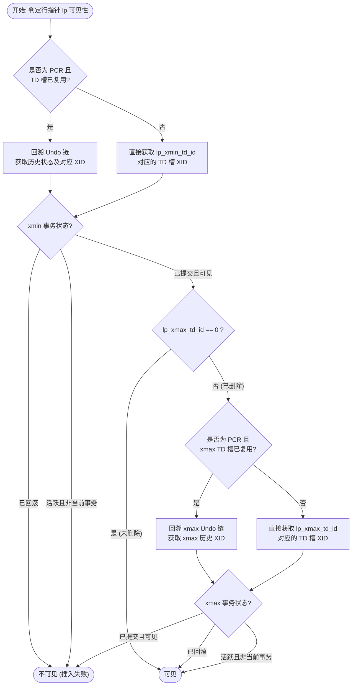
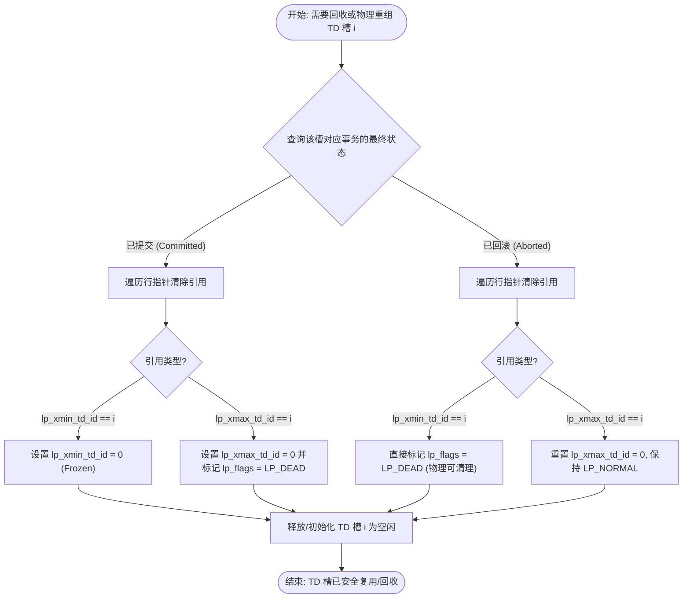

# openGauss UStore UBTree 统一页面格式设计方案 (双 TD ID 行指针版)

## 1. 背景与设计目标
在 openGauss UStore 存储引擎中，`ubtreercr` (RCR, 默认 ubtree) 和 `ubtreepcr` (PCR) 是两种并发重用索引模式：
- **RCR**：元组内置 `xmin` 和 `xmax`（`UstoreIndexXidData`，各 4 字节 `ShortTransactionId`），页面不含事务目录 (TD)。不读写 Undo，但每个元组额外多占 8 字节，CPU 非对齐访问，且代码逻辑与 PCR 完全割裂。
- **PCR**：使用页面级事务目录 (TD Slots)，通过行指针的 8-bit `lp_td_id` 引用 TD 槽，配合 Undo 日志实现多版本。

### 1.1 现有 RCR 方案的缺陷
1. **页面空间开销大**：每个元组额外占用 8 字节事务信息（`xmin` + `xmax`，即 `UstoreIndexXidData`），降低了单页索引元组的存储密度，容易引发提前分裂。
2. **非对齐内存访问**：元组尾部追加事务号导致物理布局非标准对齐，降低了 CPU 缓存效率和二分查找速度。
3. **代码与 PCR 完全割裂**：由于物理页面结构不同，查找、物理插入、分裂、合并等核心算法均有两套独立代码，维护成本极高。

### 1.2 本方案设计目标
1. **物理页面大一统**：统一 RCR 与 PCR 的页面布局与代码逻辑，二分查找、物理插入、分裂及合并代码 100% 共用。
2. **无写放大的原地逻辑删除**：通过行指针的**双 TD ID 位域结构**（`lp_xmin_td_id` + `lp_xmax_td_id`），在所有模式下实现原地修改行指针以逻辑删除，完全避免删除操作带来的物理元组空间开销与写放大。
3. **极佳的空间与对齐效率**：行指针保持标准 **4 字节 (32-bit)**，物理元组不再携带事务号，实现天然对齐与高存储密度。
4. **PCR 读路径优化**：读事务可在页面内通过双 TD ID 直接判定可见性，仅在 TD 槽被复用时才回溯 Undo。

---

## 2. 动态大小的 TD 槽设计 (避免空间浪费)

### 2.1 设计原则
RCR 页面不使用 Undo，因此其 TD 槽不需要 `undoRecPtr` (8 字节)。通过动态计算 TD 槽大小，避免空间浪费。

### 2.2 结构体定义

在 openGauss 中，`TransactionId` 为 `uint64` (8B)，`CommitSeqNo` 为 `uint64` (8B)。现有 PCR 的 TD 结构体使用全宽度 `TransactionId`，我们延续此设计。

> **注意**：现有 RCR 索引元组使用 `ShortTransactionId` (4B) 配合页面 Opaque 区域的 `xid_base` 做事务号偏移。在新 TD 槽设计中，我们也在 RCR TD 槽中使用全宽度 `TransactionId` 以保持和 PCR 的一致性，简化可见性判定代码。`xid_base` 偏移仅在 TD 槽写入时做一次转换。

```cpp
/* RCR 专用 TD 槽 (无 undoRecPtr)
 * 字段排列：csn(8B, offset 0) + xactid(4B, offset 8) + tdStatus(1B, offset 12) + pad(3B)
 * 物理大小: 16 字节
 */
typedef struct UBTreeRCRTDData {
    CommitSeqNo csn;              /* 提交序列号 (用于快照比较判定可见性) */
    ShortTransactionId xactid;    /* 短事务 ID (配合页面 xid_base 还原全量 XID) */
    uint8 tdStatus;               /* 状态位: TD_FROZEN / TD_ACTIVE / TD_COMMITED */
} UBTreeRCRTDData;  /* 物理大小: 16 字节 (csn 8B + xactid 4B + tdStatus 1B + padding 3B) */

/* PCR 专用 TD 槽 (含 undoRecPtr)
 * 沿用现有 UBTreeTDData 结构，物理大小: 32 字节
 */
typedef struct UBTreePCRTDData {
    TransactionId xactid;         /* 全宽度事务 ID */
    union {
        CommitSeqNo csn;
        struct {
            CommandId cid;
            uint32 aligned;
        } ctid;
    } combine;
    UndoRecPtr undoRecPtr;        /* Undo 回滚记录指针 (8字节) */
    uint8 tdStatus;               /* 状态位 */
} UBTreePCRTDData;  /* 物理大小: 32 字节 */
```

**RCR TD 槽结构说明**：
- `csn` (8B)：用于读快照的可见性比较。当事务提交后，TD 槽会被标记为 `TD_COMMITED` 并写入 CSN。读事务通过比较 `snapshot_csn` 与 `td.csn` 来判定可见性，这与 PCR 模式的快照读路径保持一致。
- `xactid` 使用 `ShortTransactionId` (4B)：配合页面 Opaque 区域已有的 `xid_base` 字段（参见 `UBTPageOpaqueDataInternal.xid_base`），可还原出全量 64-bit 事务号。这使得 RCR TD 槽能精确控制在 **16 字节**，与使用全量 `TransactionId` (8B) 的 24 字节方案相比，每个 TD 槽节省 8 字节。
- `tdStatus` (1B)：标识 TD 槽的状态（`TD_FROZEN`、`TD_ACTIVE`、`TD_COMMITED`）。

### 2.3 统一的页面 Opaque 结构与动态偏移计算

为使 RCR 与 PCR 页面能够以完全相同的方式计算行指针偏移、查找二分边界，我们将页面末尾的 Opaque 结构体进行大一统。不管是 RCR 还是 PCR 模式的页面，均统一使用如下 `UBTPageOpaqueData` 结构，并在其中包含 `td_count`：

```cpp
/* 统一的 UBTree 页面 Opaque 结构体 (RCR 与 PCR 共用) */
typedef struct UBTPageOpaqueData {
    BlockNumber btpo_prev;        /* 左兄弟页面 */
    BlockNumber btpo_next;        /* 右兄弟页面 */
    union {
        uint32 level;             /* 树层级 --- 叶子节点为 0 */
        ShortTransactionId xact_old;
    } btpo;
    uint16 btpo_flags;            /* 页面标志位 */
    BTCycleId btpo_cycleid;       /* 最近分裂的 Vacuum 周期 ID */

    TransactionId xact;           /* 逻辑删除事务号 */
    TransactionId last_delete_xid;
    TransactionId last_commit_xid;
    TransactionId last_prune_xid;
    uint8 td_count;               /* 页面当前分配的 TD 槽数量 (初始化默认为 4) */
    uint16 activeTupleCount;      /* 页面内活跃元组计数 */
    uint32 flags;                 /* 其他状态标志 */
    TransactionId xid_base;       /* RCR 模式下用于短事务号还原的 64 位基准事务号 */
} UBTPageOpaqueData;
typedef UBTPageOpaqueData* UBTPageOpaque;
```

#### 2.3.1 动态偏移量计算公式
所有页面偏移和指针计算由以下宏动态决定：
```cpp
/* 根据索引类型动态获取单个 TD 槽的大小 (RCR = 16B, PCR = 32B) */
#define UBTreePageGetTDSize(rel) \
    (RelationIndexIsPCR(rel->rd_options) ? sizeof(UBTreePCRTDData) : sizeof(UBTreeRCRTDData))

/* 获取指定 TD 槽的内存指针 */
#define UBTreeGetTD(page, tdid, tdSize) \
    ((void *)((char *)(page) + SizeOfPageHeaderData + (tdSize * (tdid - 1))))

/* 计算行指针 (ItemId) 数组的起始字节偏移 */
#define UBTreeGetRowPtrOffset(page, tdCount, tdSize) \
    (SizeOfPageHeaderData + (tdCount * tdSize))
```

#### 2.3.2 RCR 模式下的 `xid_base` 转换与溢出处理
在 RCR 模式下，为了将 TD 槽的大小精简为 16 字节，`UBTreeRCRTDData` 内仅存储 4 字节的 `ShortTransactionId`。转换与溢出处理原则如下：
1. **写入转换**：计算 `xactid_short = (ShortTransactionId)(xactid_64 - xid_base)`。
2. **读取还原**：计算 `xactid_64 = xid_base + (TransactionId)xactid_short`。
3. **溢出与推进**：当新事务的 `xactid_64` 小于当前的 `xid_base`，或者差值超过 `MaxShortTransactionId` 时，必须调用页面重整函数。该函数会：
   - 遍历并重新计算页面上所有活跃/提交 TD 槽内的事务号。
   - 重新设定并向前/向后平移 `xid_base`，更新 Opaque 区域，保证差值在 `ShortTransactionId` 的安全表达范围内。

#### 2.3.3 TD 槽的动态物理扩展与行指针平移
当页面面临多事务并发修改，且当前没有空闲/已冻结 of TD 槽可以复用时，需要动态分配新的 TD 槽：
1. **行指针数据平移**：将原本位于 `[UBTreeGetRowPtrOffset(page, td_count, tdSize), pd_lower)` 的行指针数组，整体向 `pd_lower` 方向物理平移 `tdSize` 字节（RCR 平移 16 字节，PCR 平移 32 字节）。
2. **更新指针与状态**：
   - 更新 Opaque 区域的 `td_count`。
   - 将页面头部的 `pd_lower` 增加 `tdSize`。
   - 此时平移留出的空间被安全初始化为新的空闲 TD 槽。

---

## 3. 双 TD ID 行指针设计 (无写放大的原地逻辑删除)

### 3.1 行指针 (`UBTreeItemIdData`) 结构
行指针保持为 32-bit 标准大小，完美对齐，位域划分如下：
```cpp
typedef struct UBTreeItemIdData {
    unsigned lp_off : 15,          /* 元组在页面中的偏移量 (0 ~ 32767) */
             lp_flags : 2,         /* 行指针状态: LP_UNUSED(0), LP_NORMAL(1), LP_REDIRECT(2), LP_DEAD(3) */
             lp_xmin_td_id : 7,    /* 插入事务的 TD 槽 ID (0 ~ 127) */
             lp_xmax_td_id : 7,    /* 删除事务的 TD 槽 ID (0 ~ 127) */
             lp_unused : 1;        /* 预留/对齐 */
} UBTreeItemIdData;
```

#### 3.1.1 关键设计参数
- **`td_id = 0` (Frozen 预留值)**：表示该事务已冻结（已提交且全局可见），与现有代码 `UBTreeFrozenTDSlotId = 0` 语义一致。可见性判定时无需查询 TD 槽。
- **`td_id ∈ [1, 127]`**：指向对应的 TD 槽。单页最大 127 个活跃并发事务槽。

#### 3.1.2 与现有 PCR 设计的差异说明
| 参数 | 现有 PCR 设计 (8-bit `lp_td_id`) | 新设计 (双 7-bit `td_id`) |
| :--- | :--- | :--- |
| TD 槽最大数量 | 128 (`UBTREE_MAX_TD_COUNT`) | **127** (差 1 个，对 B-Tree 无影响) |
| `UBTreeInvalidTDSlotId` (255) | 需要，用于标记无效 | **不再需要**。7-bit 范围 `[0,127]`，无法表达 255 |
| `lp_td_invalid` 标记 | 需要，快速判断 TD 是否已被复用 | **不再需要**。替代方案见 §3.1.3 |
| `lp_deleted` 标记 | 需要，区分插入/删除状态 | **不再需要**。通过 `lp_xmax_td_id > 0` 判断 |
| `lp_xmin_frozen` 标记 | 需要，标记 xmin 冻结 | **不再需要**。通过 `lp_xmin_td_id == 0` 判断 |

#### 3.1.3 `lp_td_invalid` 的替代方案
在现有 PCR 设计中，`lp_td_invalid` 用于快速标记"行指针引用的 TD 槽已经被后续事务复用，当前 TD 槽中的事务不再属于该行指针"。在新设计中，这一功能通过以下机制替代：

1. **TD 槽中的 `tdStatus` 状态位**：当 Prune 冻结某个 TD 槽时，会遍历所有引用该槽的行指针，并将对应的 `lp_xmin_td_id` 或 `lp_xmax_td_id` 置为 `0` (Frozen)。冻结完成后，TD 槽才被释放复用。因此在正常流程中，不存在"行指针引用了一个已被复用的 TD 槽"的状态。
2. **PCR 模式的 Undo 回溯**：如果出现延迟 Prune 导致 TD 槽被强制复用的极端情况（如 `CompactTd` 流程），PCR 模式通过 Undo 链回溯重建历史状态，无需在行指针中存储额外标志。

#### 3.1.4 单 TD ID 与双 TD ID 在 PCR 模式下的核心行为逻辑差异对比

从“单 TD ID”变更为“双 TD ID”，最大的逻辑转变在于**解耦了插入事务（xmin）和删除事务（xmax）的物理引用通道**。以下是其在 PCR 模式具体关键操作路径上的逻辑变化对比：

##### A. 插入（Insert）逻辑变化
- **单 TD ID 方案**：
  1. 申请活跃插入 TD 槽 $TD_{ins}$。
  2. 写入行指针：`lp_td_id = TD_{ins}`，`lp_deleted = 0`，`lp_td_invalid = 0`。
- **双 TD ID 方案**：
  1. 申请活跃插入 TD 槽 $TD_{ins}$。
  2. 写入行指针：`lp_xmin_td_id = TD_{ins}`，`lp_xmax_td_id = 0`。

##### B. 删除（Delete）逻辑变化
- **单 TD ID 方案**（存在覆盖冲突，必须借助 Undo）：
  1. 申请活跃删除 TD 槽 $TD_{del}$。
  2. 生成删除 Undo 记录，将原本行指针中的 $TD_{ins}$ 作为 `prev_td_id` 写入 Undo 负载。
  3. 修改行指针：将唯一的 `lp_td_id` **覆写**为 $TD_{del}$，设置 `lp_deleted = 1`。这导致原本的插入事务信息从行指针上丢失。
- **双 TD ID 方案**（无覆盖冲突，原地保留）：
  1. 申请活跃删除 TD 槽 $TD_{del}$。
  2. **直接原地修改行指针：设置 `lp_xmax_td_id = TD_{del}`**。原本的 `lp_xmin_td_id`（仍指向 $TD_{ins}$）在行指针上**予以保留**。

##### C. 读可见性判断（MVCC）逻辑变化（核心性能优化点）
- **单 TD ID 方案**：
  - 如果元组未被删除（`lp_deleted == 0`），直接通过 `lp_td_id` 判定插入事务可见性。
  - 如果元组已被删除（`lp_deleted == 1`）：由于 `lp_td_id` 此时已被删除事务覆盖，**读事务必须回溯 Undo 链**，从对应的删除 Undo 记录中提取出 `prev_td_id`，以校验插入事务是否可见。如果 `prev_td_id` 指向的 TD 槽又被复用，则需要继续回溯整个 block 的 Undo 链并进行耗时的元组物理比对（`UBTreeItupEquals`）。
- **双 TD ID 方案**：
  - 不管元组是否被删除：**行指针上同时保留了 `lp_xmin_td_id` 和 `lp_xmax_td_id`**。
  - 读事务直接分别读取 `lp_xmin_td_id`（判定插入可见性）和 `lp_xmax_td_id`（判定删除可见性），通常**仅需在页面内读取 TD 槽状态，几乎不需要去回溯和读取 Undo 日志**，极大提升了读吞吐量。

##### D. 事务回滚（Abort）逻辑变化
- **单 TD ID 方案**：
  - 插入回滚：回滚行指针为失效状态。
  - 删除回滚：必须读取对应的删除 Undo 记录，从中提取出 `prev_td_id`，再覆盖写入行指针的 `lp_td_id`，并将 `lp_deleted` 设为 `0`。
- **双 TD ID 方案**：
  - 插入回滚：同上。
  - 删除回滚：直接从对应的删除 Undo 记录中取出修改前的整型行指针镜像 `old_itemid` 并覆写恢复，`lp_xmax_td_id` 自动恢复为 `0` 或旧值，`lp_xmin_td_id` 维持原样，无需手动字段拼接。

##### E. 垃圾回收与收缩（Page Prune）逻辑变化
- **单 TD ID 方案**：
  - 遍历行指针，若 `lp_td_id == 被回收 TD`：
    - 若 `lp_deleted == 0`，则将 `lp_xmin_frozen = 1`，并需要设置 `lp_td_invalid = 1` 防复用冲突。
    - 若 `lp_deleted == 1`，将行指针标为 `LP_DEAD`。
- **双 TD ID 方案**（无冲突，状态机流转清晰）：
  - 遍历行指针，若 `lp_xmin_td_id == 被回收 TD`（且插入已提交） -> **直接将 `lp_xmin_td_id = 0`（Frozen）**。
  - 若 `lp_xmax_td_id == 被回收 TD`（且删除已提交） -> **直接将 `lp_xmax_td_id = 0` 并设 `lp_flags = LP_DEAD`**。
  - 若插入事务已回滚 -> 设 `lp_flags = LP_DEAD`。
  - 若删除事务已回滚 -> 设 `lp_xmax_td_id = 0`，保留 `lp_flags = LP_NORMAL`。

---

### 3.2 插入、删除与更新场景的处理流程

#### 3.2.1 插入场景 (Insert)
- **RCR 模式**：
  1. 在页面头部申请/复用 **16 字节 RCR TD 槽**，写入插入事务的 `xactid`，设槽 ID 为 $TD_{ins}$。
  2. 配置行指针：`lp_xmin_td_id = TD_{ins}`，`lp_xmax_td_id = 0`，`lp_flags = LP_NORMAL`。
  3. 在数据区写入物理元组。**无需记录 Undo**。
- **PCR 模式**：
  1. 在页面头部申请/复用 **32 字节 PCR TD 槽**，写入 `xactid`，设槽 ID 为 $TD_{ins}$。
  2. 配置行指针：同上。
  3. 生成 Insert Undo 记录（Payload 包含旧行指针状态），将其地址写入 TD 槽的 `undoRecPtr`。

#### 3.2.2 删除场景 (Delete)
删除为原地修改行指针，**所有模式下均实现零物理空间膨胀与写放大**：
- **RCR 模式 (原地修改，无写放大)**：
  1. 分配/复用 RCR TD 槽 $TD_{del}$，写入删除事务的 `xactid`。
  2. **直接修改行指针**：将 `lp_xmax_td_id` 设为 $TD_{del}$。页面空间开销为 0。
- **PCR 模式 (原地修改 + Undo)**：
  1. 分配/复用 PCR TD 槽 $TD_{del}$。
  2. 生成 Delete Undo 记录（Payload 见 §3.3）。
  3. 原地修改行指针：将 `lp_xmax_td_id` 设为 $TD_{del}$。

#### 3.2.3 更新场景 (Update)
B-Tree 更新拆解为"逻辑删除旧 Key + 逻辑插入新 Key"：
1. **删除旧键**：原地将旧元组行指针的 `lp_xmax_td_id` 设为 $TD_{del}$。
2. **插入新键**：写入新元组，行指针设为 `lp_xmin_td_id = TD_{ins}`，`lp_xmax_td_id = 0`。

---

### 3.3 PCR 模式的 Undo 记录设计

PCR 模式下，Undo 记录需要保存足够的信息以支持并发读回溯和事务回滚。

#### 3.3.1 Undo Payload 内容
每条 Undo 记录的 Payload 至少包含：

| 字段 | 大小 | 说明 |
| :--- | :--- | :--- |
| `old_itemid` | 4B | 修改前的行指针完整镜像（含旧的 `lp_xmin_td_id` 和 `lp_xmax_td_id`） |
| `old_xmin_xactid` | 8B | 旧 `lp_xmin_td_id` 指向的 TD 槽中当时的 `xactid` 值 |
| `old_xmax_xactid` | 8B | 旧 `lp_xmax_td_id` 指向的 TD 槽中当时的 `xactid` 值（若为 0 则无需保存） |

#### 3.3.2 为什么必须完整保存 XID，而不能仅保存两个 TD ID？

在原 PCR 方案中，Undo Payload 只保存了 1 字节的 `prev_td_id`。但在新方案中，我们选择在 Payload 中完整保存 `old_xmin_xactid` 和 `old_xmax_xactid`（每个 8B）。这是基于以下两个核心原因：

1. **解决 TD 槽复用后的 XID 丢失问题**：
   - 页面上的 TD 槽数量有限（127 个），在并发写场景下会被频繁复用。
   - 假设在 Undo Payload 中只保存了两个旧的 TD ID（例如 `old_xmin_td_id = 3` 和 `old_xmax_td_id = 4`）。一旦槽 3 或槽 4 被后续事务复用，它们所指向的活跃事务号（`xactid`）就会被覆写。
   - 此时，只凭这两个 TD ID，读事务将无法直接在内存中得知该元组在修改历史时刻对应的真实 `xmin` 和 `xmax`。

2. **避免回退到 $O(N)$ 慢速链表遍历与元组比对路径**：
   - **原 PCR 方案的局限**：只保存 `prev_td_id` 时，如果该 TD 槽被复用了，读事务为了找回真实的 `xmin`，必须**沿着整个 Block 的 Undo 链往回不断 Fetch Undo Record**，并在内存中对取出的每个元组进行物理比对（调用 `UBTreeItupEquals`），直到找到类型为 `UNDO_UBT_INSERT` 且元组相同的 Undo 记录，才能从其通用的 Undo Record 头部提取出插入事务的 XID。该过程极其缓慢且产生大量随机 I/O。
   - **新双 TD ID 方案的设计**：若在 Undo Payload 中完整保存了 `old_xmin_xactid` 和 `old_xmax_xactid`，那么当读事务发现页面 TD 槽被复用时，只需读取**当前元组关联的最新那条 Undo 记录的 Payload**，即可瞬间获取当时精确的 XID。这省去了后续所有 Undo 链的遍历和元组比对开销，将历史可见性判定开销降为稳定的 $O(1)$。

#### 3.3.3 PCR Undo 回溯流程
当读事务需要重构历史页面状态时：
1. 检查当前行指针 `lp_xmin_td_id` / `lp_xmax_td_id` 指向的 TD 槽中的事务号。
2. 如果 TD 槽中的事务号与预期不符（说明被复用了），则沿 TD 槽的 `undoRecPtr` 链回溯。
3. 从 Undo 记录中取出 `old_itemid`、`old_xmin_xactid`、`old_xmax_xactid`，恢复出该元组在读快照时间点的历史行指针状态及对应事务号。
4. 使用恢复出的历史状态执行可见性判定（§4.1）。

---

## 4. 读可见性与垃圾回收算法

### 4.1 读可见性判定 (Read Visibility)
读事务扫描页面匹配到 Key 时，判定流程如下：



1. **行指针状态恢复 (仅限 PCR 模式)**：
   - 如果当前 TD 槽已被复用（槽中事务号与行指针写入时不一致），通过 Undo 链回溯（§3.3.2）恢复历史状态。
   - **对于未复用的 TD 槽**（绝大多数近期操作）：直接走页面内快速通道，无需读取 Undo。
2. **校验插入可见性 (`xmin`)**：
   - `lp_xmin_td_id == 0` → 插入事务已冻结（全局可见）。
   - `lp_xmin_td_id > 0` → 读取 TD 槽获取插入事务号及 CSN：
     - 事务**已提交**且对当前快照可见 → 继续校验 xmax。
     - 事务**已回滚 (Aborted)** → **元组不可见**（插入从未生效）。
     - 事务**仍活跃 (Active)** 且不是当前事务 → **元组不可见**。
3. **校验删除可见性 (`xmax`)**：
   - `lp_xmax_td_id == 0` → 未被删除 → **元组可见**。
   - `lp_xmax_td_id > 0` → 读取 TD 槽获取删除事务号及 CSN：
     - 事务**已提交**且对当前快照可见 → **元组不可见** (已被删除)。
     - 事务**已回滚 (Aborted)** → 删除无效 → **元组可见**。
     - 事务**仍活跃 (Active)** 且不是当前事务 → 删除未生效 → **元组可见**。

### 4.2 事务回滚 (Abort) 的处理

> **这是 RCR 模式的关键设计点**：RCR 不写 Undo 日志，因此事务回滚时**无法物理回退**行指针的修改。

#### 4.2.1 RCR 模式的惰性判定与事务槽回收策略

由于 RCR 模式不记录 Undo 日志，当修改页面事务回滚时，不会物理修改页面。页面上的 TD 槽依然维持 `TD_ACTIVE` 状态。读事务与空间分配流程通过以下机制进行惰性判定与事务槽回收：

1. **读路径的惰性 Hint Bits 状态更新**：
   - 读事务访问页面时，通过 `lp_xmin_td_id` 或 `lp_xmax_td_id` 拿到对应的 TD 槽和其中的 `xactid`。
   - 当检测到 TD 槽仍处于 `TD_ACTIVE` 状态时，读事务会通过 CLOG（或 CSN Log）查询该 XID 的真实状态。
   - 若查询发现该事务已回滚（Aborted）：
     - **插入回滚 (Insert Abort)**：说明元组插入失败，元组不可见。
     - **删除回滚 (Delete Abort)**：说明元组逻辑删除失败，元组仍然可见。
     - **惰性 Hint Bits 写入**：读事务可在内存页面中将该 TD 槽的状态修改为 `TD_ABORTED`（或直接标记为可回收），避免后续读事务重复发起 CLOG 查询。

2. **已回滚事务槽的复用与清理机制**：
   - 当页面需要分配新的 TD 槽，或者在 Prune 阶段检测到某 TD 槽对应的 `xactid` 已经 Abort 时，可以立即回收并复用该事务槽。
   - 为了安全复用，必须先清除该页面上所有指向该槽的行指针引用，防止复用后发生可见性逻辑混乱：
     - **xmin 指向已回滚槽**：表明插入事务回滚。将该行指针直接标为 `LP_DEAD`，元组标记为可物理回收。
     - **xmax 指向已回滚槽**：表明删除事务回滚，删除未生效。**直接重置 `lp_xmax_td_id = 0`**，使元组回归正常可见状态。
     - 引用清理完毕后，该 TD 槽被标记为空闲，并可以立即供新写入事务分配复用。

#### 4.2.2 PCR 模式的精确回滚
PCR 模式下事务回滚通过 Undo 日志精确回退：
1. 沿 TD 槽的 `undoRecPtr` 找到对应的 Undo 记录。
2. 从 Undo Payload 中取出 `old_itemid`，将行指针恢复为修改前的状态。
3. 释放/更新 TD 槽。

### 4.3 垃圾回收与收缩 (Page Prune)
在 Prune 阶段对页面元组与行指针进行清理：



#### 4.3.1 TD 槽冻结 (Freeze Td)
当 TD 槽 $i$ 对应的事务已经结束（提交或回滚）且早于 `globalRecycleXid` 时，需要遍历所有引用该槽的行指针，按事务最终状态（提交 vs 回滚）分别处理：

**情况 A：TD 槽 $i$ 中的事务已提交**
- 被 `lp_xmin_td_id` 引用 → 插入已全局可见 → 设置 `lp_xmin_td_id = 0` (Frozen)。
- 被 `lp_xmax_td_id` 引用 → 删除已全局可见 → 设置 `lp_xmax_td_id = 0`，并标记 `lp_flags = LP_DEAD`（元组可物理回收）。

**情况 B：TD 槽 $i$ 中的事务已回滚**
- 被 `lp_xmin_td_id` 引用 → 插入从未生效 → 设置 `lp_flags = LP_DEAD`（元组无效，可物理回收）。
- 被 `lp_xmax_td_id` 引用 → 删除从未生效 → 设置 `lp_xmax_td_id = 0`，保持 `lp_flags = LP_NORMAL`（恢复为"未删除"状态）。

冻结完成后，释放 TD 槽 $i$ 以供新事务复用。

#### 4.3.2 物理清理与空间整理
物理移除所有 `lp_flags == LP_DEAD` 的元组数据，重整页面剩余元组偏移量（Defragmentation），将相应行指针设为 `LP_UNUSED`。

---

## 5. 页面物理布局总览

```
+---------------------------------------------------------------+
|                     PageHeaderData                            |
+---------------------------------------------------------------+
| TD_1 | TD_2 | TD_3 | ... | TD_N                              |
| (16B RCR 或 32B PCR，由 RelationIndexIsPCR 决定)               |
+---------------------------------------------------------------+
| ItemId_1 | ItemId_2 | ... | ItemId_M   (各 4B)                |
|          ^ pd_lower                                           |
+---------------------------------------------------------------+
|                    Free Space                                 |
|          v pd_upper                                           |
+---------------------------------------------------------------+
| IndexTuple_M | ... | IndexTuple_2 | IndexTuple_1             |
| (纯索引数据，不含事务信息，比现有 RCR 元组少 8B)                  |
+---------------------------------------------------------------+
|                  Special / Opaque Data                        |
| (含 xid_base、activeTupleCount 等页面级元数据)                  |
+---------------------------------------------------------------+
```

---

## 6. 方案对比与架构评估

| 评估维度 | 现有 UStore 架构 | 双 TD ID 统一布局设计 (本方案) |
| :--- | :--- | :--- |
| **行指针物理大小** | RCR 物理格式割裂，部分非标对齐 | **4 字节 (32-bit) 标准对齐** |
| **删除操作空间开销** | 原地更新，无开销 | **无物理开销**。直接原地修改 `lp_xmax_td_id` |
| **删除导致分裂** | 无风险 | **无风险**。删除操作不消耗页面空间 |
| **页面空间利用率** | 元组内置 xmin/xmax，多占 8B，降低密度 | **极高**（无膨胀，单页多容纳 ~10% 索引项） |
| **物理代码共享度** | 物理结构割裂，需要双通道独立代码 | **完全共享**。分裂、合并、查找 100% 统一 |
| **PCR 读路径 Undo 开销** | 每次读取已删除元组必须回溯 Undo | **大幅降低**。TD 未被复用时直接页面内判定 |
| **TD 槽上限** | 128 (PCR) / 无 (RCR) | **127** (B-Tree 页面并发写不超过 32，充裕) |
| **事务回滚处理** | RCR: 惰性 / PCR: Undo | **RCR: 惰性回收 / PCR: Undo 精确回退** |
