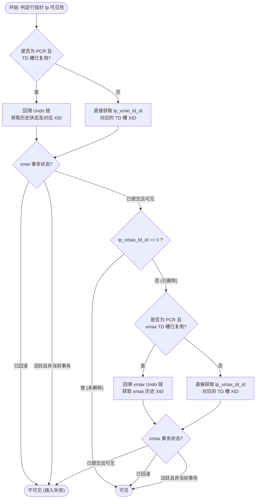

# openGauss UStore UBTree PCR (Page-level Concurrency Reuse) 深度调研报告

## 1. 概述与核心价值

在 openGauss 的 UStore 存储引擎中，`ubtreepcr`（PCR 索引）是针对高并发、多版本控制（MVCC）设计的索引并发重用模式。它的设计初衷是**解决传统索引中多版本信息导致的空间膨胀与读性能退化问题**。

### 1.1 PCR 与 RCR 的对比

| 特性维度 | RCR 模式 (ubtreercr) | PCR 模式 (ubtreepcr) |
| :--- | :--- | :--- |
| **事务控制位置** | 元组内置事务号（每个元组内置 `xmin`/`xmax`，多占 8 字节） | 页面级事务目录 (TD Slots) + 行指针引用位域 |
| **Undo 日志读写** | **不读写 Undo 日志**，通过物理页面及 CLOG 判定可见性 | **重度依赖 Undo 日志**，回溯 Undo 链以支持 MVCC 快照读 |
| **页面空间密度** | 较低（元组有额外的事务字段，且非标准对齐导致空隙） | 较高（元组无额外事务字段，通过 32-bit 行指针索引 TD 槽） |
| **删除操作开销** | 原地修改事务号，无额外元组写入 | 修改行指针并产生一条 Delete Undo 记录 |
| **回滚机制** | 惰性机制，异常结束的修改遗留在页面上，靠读路径和 Prune 判定 | 精确回滚，通过回放 Undo 链物理恢复页面上的修改状态 |

---

## 2. 物理页面结构与布局 (PCR Page Layout)

PCR 模式下的物理页面在存储布局上划分为 5 个连续的区域：

```
+---------------------------------------------------------------+
| 1. PageHeaderData (24B 标准页面头)                             |
+---------------------------------------------------------------+
| 2. UBTreeTDData 槽数组 (每个 32 字节，个数为 td_count)          |
|    - xactid (8B) / combine (8B) / undoRecPtr (8B) / tdStatus  |
+---------------------------------------------------------------+
| 3. UBTreeItemIdData 行指针数组 (每个 4 字节)                     |
|    - 处于 [PageHeaderData + td_count * 32B, pd_lower) 区间     |
+---------------------------------------------------------------+
| 4. Free Space (空闲区域)                                       |
+---------------------------------------------------------------+
| 5. IndexTuple 数据区 (从 pd_upper 到 pd_special)               |
+---------------------------------------------------------------+
| 6. UBTPCRPageOpaqueData (末尾特殊元数据区)                       |
+---------------------------------------------------------------+
```

### 2.1 事务目录槽结构 (`UBTreeTDData`)
每个 TD 槽占用 **32 字节**，定义如下：
```cpp
typedef struct {
    TransactionId xactid;         /* 全宽度活跃事务 ID */
    union {
        CommitSeqNo csn;          /* 已提交事务的提交序列号 */
        struct {
            CommandId cid;        /* 事务内部命令号 */
            uint32 aligned;
        } ctid;
    } combine;
    UndoRecPtr undoRecPtr;        /* 指向该事务在此页面产生的最新一条 Undo 记录 */
    uint8 tdStatus;               /* 状态位: TD_FROZEN / TD_ACTIVE / TD_COMMITED 等 */
} UBTreeTDData;
```

### 2.2 行指针位域结构 (`UBTreeItemIdData`)
行指针占用 **4 字节（32-bit）**，精细划分如下位域：
```cpp
typedef struct UBTreeItemIdData {
    unsigned lp_off : 15,          /* 元组在页面中的物理偏移量 */
             lp_flags : 2,         /* 行指针状态: LP_UNUSED / LP_NORMAL / LP_DEAD 等 */
             lp_td_id : 8,         /* 引用的 TD 槽 ID (1 ~ 128) */
             lp_td_invalid : 1,    /* 标记 TD 槽是否被后续事务强制复用 */
             lp_deleted : 1,       /* 标记该元组是否已被逻辑删除 */
             lp_xmin_frozen : 1,   /* 标记插入该元组的事务是否已被冻结 */
             lp_aligned : 4;       /* 对齐填充 */
} UBTreeItemIdData;
```

### 2.3 页面末尾 Opaque 结构 (`UBTPCRPageOpaqueData`)
PCR 页面末尾存储特定的元数据：
```cpp
typedef struct {
    BlockNumber btpo_prev;        /* 左兄弟页面 */
    BlockNumber btpo_next;        /* 右兄弟页面 */
    union {
        uint32 level;             /* B-Tree 层级 */
        ShortTransactionId xact_old;
    } btpo;
    uint16 btpo_flags;            /* 页面控制标志 */
    BTCycleId btpo_cycleid;
    TransactionId xact;
    TransactionId last_delete_xid;
    TransactionId last_commit_xid;/* 页面上最近提交事务的 XID */
    TransactionId last_prune_xid;
    uint8 td_count;               /* 页面内已分配的 TD 槽数量 */
    uint16 activeTupleCount;      /* 页面内当前活跃元组数 */
    uint32 flags;
} UBTPCRPageOpaqueData;
```

---

## 3. 事务目录 (TD) 管理与生命周期

TD 槽用于连接“行指针”与“真实的活跃事务”，其数量是动态伸缩的。

### 3.1 TD 槽的动态扩展 (`UBTreeExtendTDSlots`)
当事务准备修改页面，且当前页面没有空闲的 TD 槽时，会触发物理扩展：
1. **步长计算**：若 `td_count < 32`（`UBTREE_TD_THRESHOLD_FOR_PAGE_SWITCH`），则激进扩展；否则每次以 2 个（`UBTREE_TD_SLOT_INCREMENT_SIZE`）的步长扩展，最大不能超过 `UBTREE_MAX_TD_COUNT = 128`。
2. **行指针物理平移**：使用 `memmove_s` 将原本位于行指针区 `[start, phdr->pd_lower)` 的所有 `UBTreeItemIdData` 整体向后平移 `numExtended * 32` 字节，腾出物理空间。
3. **初始化与更新**：新腾出的空间初始化为 `TD_FROZEN` 状态的空闲槽。更新 `opaque->td_count` 和 `phdr->pd_lower`，记录 `XLOG_UBTREE3_EXTEND_TD_SLOTS` 日志。

### 3.2 TD 槽的冻结与回收 (`UBTreePageFreezeTDSlots`)
当页面修改频繁、TD 槽吃紧时，系统会尝试回收已结束事务的槽：
1. **收集可冻结槽**：遍历页面上的 TD 槽，若 `xactid` 早于全局回收阈值 `globalRecycleXid`（意味着该事务修改已对所有活跃快照可见），则放入 `frozenSlots` 数组。
2. **清除行指针引用 (`UBTreeFreezeOrInvalidIndexTuples`)**：
   - 遍历页面内所有行指针，若行指针的 `lp_td_id` 在冻结列表中：
     - 若该元组已删除 (`lp_deleted == 1`) -> 直接调用 `ItemIdMarkDead` 物理标记元组为死。
     - 若该元组未删除 -> 设置 `lp_xmin_frozen = 1`，将 `lp_td_id` 置为 `UBTreeFrozenTDSlotId = 0`，清除 `lp_td_invalid`。
3. **完成冻结**：将对应的 TD 槽调用 `setFrozen()` 重置，并写入 `XLOG_UBTREE3_FREEZE_TD_SLOT` WAL。
4. **延迟提交槽的复用与无效化**：如果事务已提交/已回滚，但其 XID 仍对某些活跃快照可见（不能物理冻结）：
   - **已回滚事务**：直接调用 `ExecuteUndoActionsForUBTreePage` 物理执行回滚。
   - **已提交事务**：将引用这些槽的 ItemId 的 `lp_td_invalid` 标记置为 `1`。然后将该槽的 `xactid` 擦除并改为 `TD_COMMITED`，但**保留 `undoRecPtr` 不动**，以确保旧快照能够通过该槽回溯 Undo 链，而此槽已被强行释放给新事务复用。

---

## 4. 写操作流程与 Undo 记录生成

### 4.1 元组插入流程
在 `ubtpcrinsert.cpp` 的 `UBTreePCRDoInsert` 中：
1. 查找插入位置。若页面满或 TD 槽耗尽，可能触发分裂。
2. 申请活跃 TD 槽（填入当前事务的 XID）。
3. 产生一条类型为 `UNDO_UBT_INSERT` 的 Undo 记录（通过 `UBTreePCRPrepareUndoInsert`），在其 Payload 区存入 `UBTreeUndoInfoData`（包含 `prev_td_id`）和 `IndexTuple` 字节。
4. 将产生的 `urecPtr` 存入 TD 槽的 `undoRecPtr` 中。
5. 写入物理页面行指针：`lp_td_id = tdSlot`，`lp_deleted = 0`。

### 4.2 元组删除流程
在 `ubtpcrinsert.cpp` 的 `UBTreePCRDoDelete` 中：
1. 定位要删除的元组。
2. 申请活跃删除 TD 槽。
3. 产生一条类型为 `UNDO_UBT_DELETE` 的 Undo 记录（通过 `UBTreePCRPrepareUndoDelete`），在其 Payload 同样打包旧的 `lp_td_id` 及元组信息。
4. **关键一步**：在行指针上，将 `lp_td_id` **覆盖改写**为删除事务的 TD 槽 ID，并设置 `lp_deleted = 1`。

---

## 5. MVCC 读可见性判定机制 (`IndexTupleSatisfiesMvcc`)

当读事务扫描到某行指针时，判定流程如下：



### 5.1 `IndexTupleSatisfiesMvcc` 详细逻辑流转步骤

该函数是 PCR 模式 MVCC 的核心，其完整执行逻辑可分为**四个判定层级**：

#### 第一层：快速通道校验（Fast-Path）
1. **冻结状态检查 (`check_frozen`)**：
   - 若行指针的 `lp_td_id == UBTreeFrozenTDSlotId (0)`，或者对应的 TD 槽被标记为 `TD_FROZEN`：说明该行指针的最后一次修改早已超越全局回收水位（已提交且全局可见）。
   - **结论**：直接返回 `!tupleDeleted`（未删除则可见，已删除则不可见）。
2. **当前事务号检查**：
   - 获取 TD 槽中的当前事务号 `xid = td->xactid`。
   - 若 `xid` 是当前读事务自己的事务号，且该行指针未被标记复用（`!lp_td_invalid`）：
     - 读事务需要回溯该 TD 槽挂载的本地 Undo 链，对比各操作的命令号（`CommandId`）。如果 Undo 记录的 `Cid() >= snapshot->curcid`，则该修改对当前快照不可见。
     - **结论**：返回 `cidVisible != tupleDeleted`。
3. **全局回收水位判定**：
   - 检查 `xid` 是否早于全局回收阈值 `globalRecycleXid`。
   - 或者 `xid` 早于 `globalFrozenXid` 且早于快照的 `xmin`。
   - 或者当 TD 槽已被复用（`lp_td_invalid == 1`）但页面的提交水位 `last_commit_xid` 已经早于快照的 `xmin` 时。
   - **结论**：说明历史修改均已提交且对该快照可见，直接返回 `!tupleDeleted`。

#### 第二层：活跃事务可见性判定
如果无法通过快速通道判定，读事务需要利用 TD 槽中当前的 `xactid` 到 CLOG/CSN 历史中进行常规快照校验：
1. 获取该事务的提交序列号 `csn`。
2. 若 `csn` 状态为**已提交 (Committed)**：若 `csn < snapshot->snapshotcsn`，则事务可见（`xidVisible = true`），否则不可见（`xidVisible = false`）。
3. 若 `csn` 状态为**正在提交中 (Committing)**：读事务会调用 `SyncWaitXidEnd` 同步等待该事务最终结束，随后重新获取状态判定。
4. 若 `csn` 状态为**活跃/回滚 (Active/Aborted)**：不可见（`xidVisible = false`）。
5. **快速判定**：若上面计算出的 `xidVisible` 为 **`true`**，则无需回溯 Undo。直接返回 `!tupleDeleted`。

#### 第三层：退化路径——回溯 Undo 链（Slow-Path）
如果 `xidVisible` 为 **`false`**（即最近修改该元组的事务对当前快照不可见，或 TD 槽已被强行复用），读事务必须通过读取 Undo 日志来追溯该元组在快照时间点的历史状态：
1. **初始化回溯**：实例化 `UndoRecord`，将初始 URP 设为 TD 槽的 `td->undoRecPtr`。
2. **沿 `blkprev`（块内前驱 Undo 指针）向前循环遍历**：
   - **XID 变更判定（槽复用检测）**：
     - 若当前读取的 Undo 记录的 `Xid` 与 TD 槽初始 XID 不符（`urec->Xid() != td->xactid`），说明发生了槽位复用。
     - 此时，读事务需单独计算该 Undo 对应事务的可见性（判断其 `Xid` 是否早于快照 `xmin`，或其提交 `csn` 是否早于快照 `snapshotcsn`）。
     - 一旦该 Undo 的修改被判定为**可见**，则代表找到了快照时间点的最新状态，可以**终止循环**。
   - **元组比对**：
     - 从 Undo 记录中反序列化出元组数据，通过 `UBTreeItupEquals(itup, undoItup)` 与页面上当前元组做物理比对。
     - 若**比对成功**（找到了操纵该元组的历史 Undo 记录）：
       - **情况 A**：若页面元组当前状态为未删除（`!tupleDeleted`）：说明它的插入操作对快照不可见。**跳出循环**（最终结果为不可见）。
       - **情况 B**：若页面元组当前状态为已删除（`tupleDeleted == true`）：说明该不可见的最近修改是个“删除操作”。既然删除不可见，该元组在历史快照点应当“恢复为存在状态”，故设置 `tupleDeleted = false`。由于我们要进一步校验它的插入事务是否可见，读事务会从 Undo 记录的 `UBTreeUndoInfoData` 中读取 `prev_td_id`。如果 `prev_td_id != tdid`，说明插入和删除在不同槽，**直接释放当前 urec 并跳转回第一层的 `check_frozen` 重新判定 `prev_td_id` 的可见性**。
   - **指针前驱重置**：若未匹配成功，则执行 `urec->Reset2Blkprev()` 继续向前追溯。

3. **返回最终判定**：
   循环退出后，最终返回 `xidVisible != tupleDeleted`。

### 5.2 为什么要回溯 Undo 链？
由于行指针上只有一个 `lp_td_id`，一旦元组被删除，删除事务的 TD ID 会覆盖原来的插入事务 TD ID。读事务必须顺着删除事务 TD 的 `undoRecPtr` 回溯 Undo 链，读取前一个 Undo record，从其 Payload 的 `prev_td_id` 中获取插入事务的 TD ID，从而判定 `xmin` 可见性。
如果 TD 槽已被后续写事务强制复用（即 `lp_td_invalid = 1`），那么原来的 `lp_td_id` 已经彻底失效。读事务同样必须沿着 Undo 链往回搜索，直到找到当时操作它的那条 Undo 记录（根据 `xid` 和 `IndexTuple` 内存比对确定），方能确定可见性。

---

## 6. 精确回滚机制 (Rollback)

在 `ubtpcrrollback.cpp` 中，异常中断或回滚至保存点时，由 `ExecuteUndoActionsForUBTreePage` 物理执行回滚：

1. **定位 Undo 链**：根据传入的 `tdid`，读取页面 TD 槽的 `undoRecPtr`。
2. **回溯并应用**：调用 `FetchUndoRecordRange` 获取相关的 Undo Record。对每条记录调用 `RollbackOneUndoRecord` -> `ExecuteRollback`：
   - **`UNDO_UBT_INSERT` 回滚**（回滚插入）：
     - 将该行指针的状态设为删除状态（`lp_deleted = 1`），如果原前置事务 `prevTDid` 已冻结，则直接将该行指针标为 `lp_flags = LP_DEAD`。
     - 将其 `lp_td_id` 重新改写为 Undo Payload 中恢复出来的 `prev_td_id`。
     - 递减页面活跃元组计数 `activeTupleCount`。
   - **`UNDO_UBT_DELETE` 回滚**（回滚删除）：
     - 清除行指针的删除标记（`lp_deleted = 0`）。
     - 将 `lp_td_id` 重新设为从 Undo Payload 中回复出来的 `prev_td_id`。
     - 恢复行指针状态为正常状态（`UBTreeItemIdSetNormal`）。
     - 递增页面活跃元组计数 `activeTupleCount`。
3. **回写 TD 状态**：使用 `SetTDInfo` 更新 TD 槽状态，将其指针往前退回 `Blkprev`，直至事务开始点，写入 `XLOG_UBTREE3_ROLLBACK_TXN`。

---

## 7. 空间回收与物理清理 (Page Prune)

在 `ubtpcrrecycle.cpp` 发生 Page Prune 时：
1. 物理移除所有标记为 `lp_flags == LP_DEAD`（即已经冻结的删除元组或已经回滚的插入元组）的数据。
2. **Defragmentation (空间整理)**：
   - 提取所有存活元组，计算对齐长度。
   - 按照旧 `itemoff` 的降序进行 `qsort` 排序。
   - 通过 `memmove_s` 将页面底部的 Tuple 数据往页面尾部（`pd_special` 方向）紧凑移动。
   - 重新计算并写入每个 ItemId 的新 `lp_off`，更新 `pd_upper`。
3. 将清理后的行指针末尾与空闲空间边界写入 `pd_lower`，回收物理空间。

---

## 8. 调研总结与架构设计启示

通过以上调研，可以总结出 `ubtreepcr` 现有实现的优缺点，并为后续双 TD 设计提供依据：

1. **多版本完全在 Undo 链中解析**：PCR 页面的干净很大程度依赖 Undo 日志。对于读取已删除但未 prune 的元组，频繁读取 Undo Page 会带来不可忽视 of CPU 和 I/O 开销。
2. **行指针单 TD 限制了信息完整性**：删除操作覆盖 `lp_td_id` 导致 xmin 信息丢失，是导致 MVCC 必须强行读取 Undo 链的根本原因。
3. **ItemId 物理平移是可行的**：`UBTreeExtendTDSlots` 中使用 `memmove_s` 平移 ItemId 数组并更新 `pd_lower` 的技术是成熟且稳定的。因此，在我们的双 TD 设计中，动态分配新 TD 槽时进行平移，可以直接复用该成熟机制。
4. **向双 TD ID (7-bit xmin + 7-bit xmax) 演进的必要性**：
   - 能够消除 `lp_deleted`、`lp_td_invalid`、`lp_xmin_frozen`。
   - 能够将 MVCC 可见性判定的平均时间复杂度从 $O(N)$ 降到 $O(1)$。
   - 能够统一 RCR 与 PCR 的页面布局，实现核心的 binary search 和 insert 代码 100% 共享。
